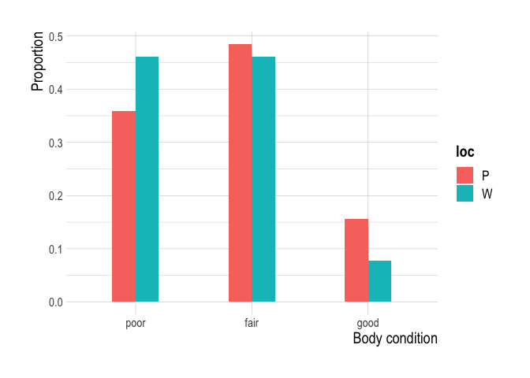
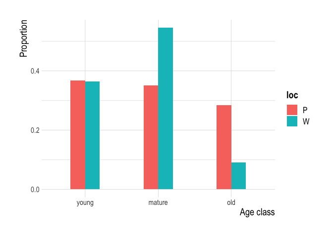
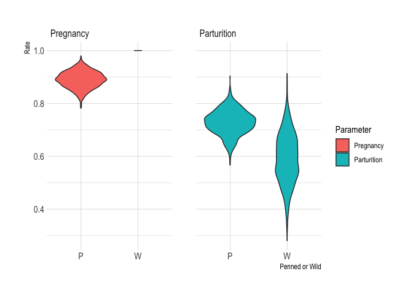

Klinse-Za Penning Demography
================
Clayton Lamb
01 July, 2021

## Load Packages & Data

``` r
library(survival)
library(here)
library(lubridate)
library(MuMIn)
library(survminer)
library(hrbrthemes)
library(tidyverse)
library(tidylog)
library(infer)
library(readxl)
library(lme4)
library(ggpubr)
library(chisq.posthoc.test)
library(rgee)
library(sf)
library(raster)
options(scipen=999)
source(here::here("functions","seasonalsurvival_fn.r"))

#ADULT FEMALE SURVIVAL
df <- read_excel(here::here("data","demography", "AllHerdsStartEndDates_210421.xlsx"))%>%
  filter(herd%in%c("K","S"),
         Sex%in%"F")
  
#ADULT FEMALE LOCATIOn (IN/OUT OF PEN)
ad.cap <- read_excel(here::here("data","demography", "Klinse-za capture and demographics_210521.xlsx"),
                     sheet="Adult-Capt")%>%
      drop_na(CalendarYr)

##PENNING DATES
pen <- tribble(
  ~year,~into, ~out,
  2014, "2014-03-27", "2014-07-05",
  2015, "2015-03-18", "2015-07-24",
  2016, "2016-03-16", "2016-07-15",
  2017, "2017-03-23", "2017-07-27",
  2018, "2018-03-13", "2018-07-31",
  2019, "2019-03-12", "2019-07-29",
  2020, "2020-03-11", "2020-08-05",
  2021, "2021-03-15", "2021-08-05")%>%
  mutate(free_end=(ymd(dplyr::lead(into,1,order_by=year))-1)%>%as.character,
      penned=ymd(into)%--%ymd(out),
      free=ymd(out)%--%ymd(free_end))

##CALF SURVIVAL
calf <- read_excel(here::here("data","demography", "Klinse-za capture and demographics_210521.xlsx"),
                     sheet="Calf-Capt")%>%
    drop_na("Mom_ID")

##MORTS
# mort <- read_excel(here::here("data","demography", "Klinse-za capture and demographics_210521.xlsx"),
#                      sheet="Mortalities")

##PARTURITION
mm.part <- read_csv(here::here("data","demography", "MovementModelResults.csv"))%>%
  drop_na(Caribou_ID)

##CONDITION
cond <- read_csv(here::here("data","health", "KZONCP_Health_Year2_results_210422.csv"))
```

## Clean and Prep

``` r
#MIN AGE VIA BIRTHDATE (MAYBE REDUNDANT?)
df <- df %>% 
  mutate(rstart_dat=rstart_dat%>%date,
         rend_dat=rend_dat%>%date,
    birth=case_when(agecl%in%"C" & month(rstart_dat) %in% 5:12~ paste(year(rstart_dat),"-06-01",sep="-")%>%ymd,
                    agecl%in%"C" & month(rstart_dat) %in% 1:4~ paste(year(rstart_dat)-1,"-06-01",sep="-")%>%ymd,
                    agecl%in%"Y" & month(rstart_dat) %in% 5:12~ paste(year(rstart_dat)-1,"-06-01",sep="-")%>%ymd,
                    agecl%in%"Y" & month(rstart_dat) %in% 1:4~ paste(year(rstart_dat)-2,"-06-01",sep="-")%>%ymd,
                    agecl%in%"A"~ paste(year(rstart_dat)-3,"-06-01",sep="-")%>%ymd))

#CLASSIFY AS DEAD OR ALIVE
#one myop but happens in 2002. Watch for myop pen 2020 (don't see here yet)
unique(df$mortcaus)
```

    ## [1] "DEAD" "FADE" "MYOP"

``` r
df <- df %>% 
  filter(!mortcaus %in%"MYOP")%>%
  mutate(dead=case_when(mortcaus%in%c("DEAD")~1,
                        mortcaus%in%c("FADE")~0))

##get columns named appropriately for function
df <- df %>% 
  dplyr::select(id=animal_id,
         herd,
         start=rstart_dat,
         end=rend_dat,
         dead,
         birth,
         agecl)

##find issues any date issues
df <- df%>%
  mutate(dur=(end-start)%>%as.numeric)

df%>%
  filter(dur<1) ## all good


## Get into survival format
##make daily survival
surv <- stretch_survival_data(df, '1 day')

nrow(surv)
```

    ## [1] 75592

``` r
sum(df$dur) ##should be same
```

    ## [1] 75592

## Assign penned animals and seasons

``` r
####ASSIGN SEASONS
##Assign penned time and drop data before this period
surv <- surv%>%
  mutate(dur=(end-start)%>%as.numeric(),
         year=year(end),
         season=case_when(start %within% as.list(pen$penned)~"Pen", 
                          start %within% as.list(pen$free)~"Free",
                          TRUE~NA_character_))%>%
  drop_na(season)

##drop penned 2021
surv <- surv%>%
  filter(start<ymd("2021-03-15"))
           

##clean up id's (get rid of trailing letter denoting period)
surv <- surv %>% 
  mutate(id=str_sub(id,1,-2))

##plot
ggplot(surv, aes(x=end,y=id,color=season))+
  geom_point(size=0.01)+
  facet_wrap(vars(season))+
  theme_ipsum()+
  labs(title="Season")
```

<!-- -->

``` r
####ASSIGN LOCATIONS IN/OUT
##decide who was in the pen
pen.yr <- ad.cap %>% 
  dplyr::select(id=WimsId, paste0("Capt",14:21))%>%
  pivot_longer(-id)%>%
  mutate(id=paste0("CN", str_sub(id,2,-1)),
         year=paste0("20", str_sub(name,-2,-1))%>%as.numeric)

##figure out first year animals were penned
pen.yr.first <- pen.yr %>% 
  drop_na(value)%>%
  dplyr::select(id,year)%>%
  rbind(surv%>%
          filter(id%in%pen.yr$id)%>%
          group_by(id)%>%
          summarise(year=min(year(start))))%>%
  group_by(id)%>%
  summarise(min.year=min(year))

##join pen locs and first yeat together
pen.yr <- pen.yr%>%
  left_join(pen.yr.first)%>%
  mutate(value=case_when(is.na(value)~"W",
                         TRUE~value))%>%
  filter(year>=min.year)%>%
  dplyr::select(id, loc=value, year)%>%
  distinct(id,year,.keep_all = TRUE)%>%
  left_join(pen%>%dplyr::select(year,penned,free), by="year")

##export for RSF analysis
write_csv(pen.yr, here::here("data","whopenned.csv"))

##bind with surv
surv <- surv %>% 
  left_join(pen.yr%>%dplyr::select(id,loc,year)%>%distinct(), by=c("id","year"))%>% ##where each animal was per year
  left_join(pen.yr%>%mutate(year=year)%>%dplyr::select(year,id,free)%>%distinct(), by=c("id","year"))%>% ##add in "free" dates
  left_join(pen.yr%>%mutate(year=year+1)%>%dplyr::select(year,id,loc_prev=loc,free_prev=free)%>%distinct(), by=c("id","year")) ##add in lag of where they were year before


##find errors, join is missing some animals
surv%>%
  filter(is.na(loc))%>%
  group_by(id)%>%
  count

###if NA, drop
surv <- surv %>% 
  drop_na(loc)


ggplot(surv%>%distinct(id,year,loc), aes(x=year,y=id,color=loc,group=id))+
  geom_path()+
  geom_point()
```

<!-- -->

``` r
##fix when pen yr assigned to few months before in pen
surv <- surv%>%
  mutate(loc=case_when(start%within%free_prev  ~ loc_prev,
                       TRUE~loc))


##get age and remove calves and yearlings
surv <-surv %>% 
  mutate(age=(end-birth)%>%time_length("year"))%>%
  filter(age>2)

length(unique(surv$id))
```

    ## [1] 46

``` r
##get to pen-only times
surv <- surv%>%filter(start>=ymd("2014-03-27"))

##make sure it all adds up
##missing two penned animals in 2020
##rest of discrepancy is juveniles. Are they collared?
##wild won't add up as I forced wild when not penned
summary <- surv%>%
  filter(season%in%"Pen")%>%
  group_by(year,loc)%>%
  summarize(n_telem_surv=n_distinct(id))
summary%>%filter(year>2013)%>%arrange(loc)%>%
  left_join(read_excel(here::here("data","demography", "Klinse-za capture and demographics_210521.xlsx"),
                     sheet="Adult-Capt")%>%
      drop_na(CalendarYr)%>%
              dplyr::select(id=WimsId, paste0("Capt",14:20))%>%
              pivot_longer(-id)%>%
              mutate(id=paste0("CN", str_sub(id,2,-1)),
                     year=paste0("20", str_sub(name,-2,-1))%>%as.numeric)%>%
              dplyr::select(id, loc=value, year)%>%
              drop_na(loc)%>%
              group_by(year,loc)%>%
              summarize(n_pen.yr=n_distinct(id)))


ggplot(surv, aes(x=end,y=id,color=season))+
  geom_point(size=0.01)+
  facet_wrap(vars(season, loc))+
  theme_ipsum()
```

<!-- -->

``` r
##fix year for records just prior to penning
surv <- surv%>%
  left_join(pen%>%
              mutate(prepen=(ymd(paste0(year(ymd(into)),"-01-01"))-1) %--% ymd(into))%>%dplyr::select(year, prepen))%>%
  mutate(year=case_when(end %within% prepen~year-1, TRUE~year))
```

## Calculate time since penned

``` r
##idea from here https://stackoverflow.com/questions/26553638/calculate-elapsed-time-since-last-event/26555648
# set.seed(12345)
# id <- c(rep(1, 9), rep(2, 9), rep(3, 9))
# time <- c(seq(from = 0, to = 96, by = 12),
#           seq(from = 0, to = 80, by = 10),
#           seq(from = 0, to = 112, by = 14))
# random <- runif(n = 27)
# event <- rep(100, 27)
# 
# df <- data.frame(cbind(id, time, event, random))
# df$event <- ifelse(df$random < 0.55, 0, df$event)
# df <- subset(df, dplyr::select = -c(random))
# #df$event <- ifelse(df$time == 0, 100, df$event)
# head(df)
# df %>%
#   mutate(tmpG = cumsum(c(FALSE, as.logical(diff(event==100)))))%>%
#   group_by(id) %>%
#   mutate(tmp_a = c(0, diff(time)) * !event) %>%
#   group_by(tmpG) %>%
#   mutate(tae = cumsum(tmp_a)) %>%
#   ungroup() %>%
#   dplyr::select(-c(tmp_a, -tmpG))


surv <- surv%>%
  mutate(inpen=case_when(season%in%"Pen" & loc%in%"P"~1,
                          TRUE~0))%>%
  mutate(tmpG = paste(cumsum(c(FALSE, as.logical(diff(inpen==1)))),id))%>%
  group_by(id) %>%
  mutate(tmp_a = case_when(first(loc)%in%"W" & tmpG==min(tmpG)~0,
                           TRUE~dur * !inpen)) %>%
  group_by(tmpG) %>%
  mutate(timesince = cumsum(tmp_a)) %>%
  ungroup()%>%
  dplyr::select(id,start,end,dead,dur,year,season,loc,loc_prev,inpen,timesince)


##times penned
surv <- surv%>%
  left_join(surv%>%
  filter(loc=="P" & season=="Pen")%>%
  distinct(id,year(end),loc)%>%
  group_by(id)%>%
  summarize(times.penned=n()))%>%
  mutate(times.penned=case_when(is.na(times.penned)~as.integer(0),
                                TRUE~times.penned))
  


##sum up across individuals and covariates of interest
surv.pen <- surv%>%
  group_by(id,year,season,loc, times.penned)%>%
  summarise(dur=sum(dur),
            dead=max(dead),
            sincepen=max(timesince)/365)%>%
  rename(PenSeason=season,
         PennedThatYear=loc)


##how many individuals per group?
surv.pen%>%
  group_by(PennedThatYear,PenSeason)%>%
  summarize(n=n_distinct(id))

##individuals penned post 2018
surv.pen%>%
  filter(year>=2018)%>%
  group_by(PennedThatYear,PenSeason)%>%
  summarize(n=n_distinct(id))


##distribution of durations monitored
hist(surv.pen$dur)
```

<!-- -->

``` r
##distribution of times penned
times.penned <- surv.pen%>%ungroup%>%filter(PenSeason=="Pen")%>%distinct(id, .keep_all=TRUE)
times.penned%>%summarise(median=median(times.penned))
hist(times.penned%>%pull(times.penned))
```

<!-- -->

## Assess if differences in body condition or age between penned vs wild

``` r
##prep body condition data
bod.cond <- pen.yr%>%
  dplyr::select(id,loc,year)%>%
  left_join(cond%>%
              mutate(id=paste0("CN",str_sub(`WII Animal ID`,2,-1)))%>%
              filter(ymd(Date)%>%month %in%2:4)%>%
              dplyr::select(id,year=Year, condition_clean, age_clean))%>%
    mutate(age_clean=case_when(age_clean%in%c("mature", "mature (6-7)","mature (7)","mature (4-7)","mature (4-5)")~"mature",
                             age_clean%in%c("old","old (8-9)","old (10-11)","old (8-11)")~"old",
                             age_clean%in%c("young","young (2-3)", "yearling")~"young",
                             age_clean%in%c("unk")~"unk"))%>%
  drop_na(condition_clean)


##plot
bod.cond%>%
  filter(condition_clean%in%c("poor", "fair", "good"))%>%
  group_by(loc, condition_clean)%>%
  summarise(n = n()) %>%
  group_by(loc)%>%
  mutate(freq = n / sum(n),
         condition_clean=factor(condition_clean, levels=c("poor", "fair", "good")))%>%
  ungroup()%>%
  ggplot(aes(x=condition_clean, y=freq, fill=loc))+ 
  geom_col(position = "dodge", width=0.4)+
  theme_ipsum()+
  theme(legend.title=element_text(face = "bold",size = rel(1.3)))+
    labs(y="Proportion", x="Body condition")+
  theme(axis.title.x = element_text(size=15),
        axis.title.y = element_text(size=15),
        strip.text.x = element_text(size=15),
        strip.text.y = element_text(size=15),
        axis.text = element_text(size=10),
        legend.text = element_text(size=13),
        legend.title=element_text(size=15))
```

<!-- -->

``` r
##chi square
bod.matrix <- bod.cond%>%
  filter(condition_clean%in%c("poor", "fair", "good"))%>%
  mutate(condition_clean=factor(condition_clean, levels=c("poor", "fair", "good")))%>%
  group_by(loc, condition_clean)%>%
  summarise(n = n())%>%
  pivot_wider(names_from="condition_clean",values_from="n")%>%
  column_to_rownames(var="loc")%>%
  as.matrix()
  
chisq.test(bod.matrix)
```

    ## 
    ##  Pearson's Chi-squared test
    ## 
    ## data:  bod.matrix
    ## X-squared = 0.78713, df = 2, p-value = 0.6746

``` r
# Shows post-hoc pairwise comparisons using fdr method
chisq.posthoc.test(bod.matrix,
                   method = "bonferroni")


##prep and plot ages
bod.cond%>%
  filter(age_clean%in%c("young", "mature", "old"))%>%
  group_by(loc, age_clean)%>%
  summarise(n = n()) %>%
  group_by(loc)%>%
  mutate(freq = n / sum(n),
         age_clean=factor(age_clean, levels=c("young", "mature", "old")))%>%
  ungroup()%>%
  ggplot(aes(x=age_clean, y=freq, fill=loc))+ 
  geom_col(position = "dodge", width=0.4)+
  theme_ipsum()+
  theme(legend.title=element_text(face = "bold",size = rel(1.3)))+
      labs(y="Proportion", x="Age class")+
  theme(axis.title.x = element_text(size=15),
        axis.title.y = element_text(size=15),
        strip.text.x = element_text(size=15),
        strip.text.y = element_text(size=15),
        axis.text = element_text(size=10),
        legend.text = element_text(size=13),
        legend.title=element_text(size=15))
```

<!-- -->

``` r
##chi square
age.matrix <- bod.cond%>%
  mutate(age_clean=factor(age_clean, levels=c("young", "mature", "old")))%>%
   filter(age_clean%in%c("young", "mature", "old"))%>%
  group_by(loc, age_clean)%>%
  summarise(n = n())%>%
  pivot_wider(names_from="age_clean",values_from="n")%>%
  column_to_rownames(var="loc")%>%
  as.matrix()
  
chisq.test(age.matrix)
```

    ## 
    ##  Pearson's Chi-squared test
    ## 
    ## data:  age.matrix
    ## X-squared = 2.2917, df = 2, p-value = 0.3179

``` r
# Shows post-hoc pairwise comparisons using fdr method
chisq.posthoc.test(age.matrix,
                   method = "bonferroni")
```

# Model survival

## Survival data summary stats

``` r
##inds
n_distinct(surv.pen$id)
```

    ## [1] 46

``` r
surv.pen%>%
  group_by(PennedThatYear)%>%
  summarise(animalyrs=sum(dur)/365,
            dead=sum(dead))


summary(survfit(Surv(dur, dead)~ PennedThatYear, data = surv.pen%>%group_by(id,PennedThatYear)%>%summarise(dur=sum(dur),dead=max(dead))), times = 365)
```

    ## Call: survfit(formula = Surv(dur, dead) ~ PennedThatYear, data = surv.pen %>% 
    ##     group_by(id, PennedThatYear) %>% summarise(dur = sum(dur), 
    ##     dead = max(dead)))
    ## 
    ##                 PennedThatYear=P 
    ##         time       n.risk      n.event     survival      std.err lower 95% CI upper 95% CI 
    ##     365.0000      29.0000       5.0000       0.8718       0.0535       0.7729       0.9833 
    ## 
    ##                 PennedThatYear=W 
    ##         time       n.risk      n.event     survival      std.err lower 95% CI upper 95% CI 
    ##     365.0000      23.0000       5.0000       0.8462       0.0633       0.7308       0.9800

## Survival spring-march for recruitment

``` r
##inds
surv.recruit <- surv%>%
  filter(!month(start)%in%c(3:5))%>%
  group_by(id,year,loc, times.penned)%>%
  summarise(dur=sum(dur),
            dead=max(dead))%>%
  rename(PennedThatYear=loc)


summary(survfit(Surv(dur, dead)~ PennedThatYear, data = surv.recruit), times = 273)
```

    ## Call: survfit(formula = Surv(dur, dead) ~ PennedThatYear, data = surv.recruit)
    ## 
    ##                 PennedThatYear=P 
    ##         time       n.risk      n.event     survival      std.err lower 95% CI upper 95% CI 
    ##     273.0000      78.0000       5.0000       0.9398       0.0261       0.8899       0.9924 
    ## 
    ##                 PennedThatYear=W 
    ##         time       n.risk      n.event     survival      std.err lower 95% CI upper 95% CI 
    ##     273.0000      52.0000      10.0000       0.8402       0.0464       0.7540       0.9362

## CoxPh

``` r
##COXPH survival
m1 <- coxph(Surv(dur, dead)~ 1 +
              frailty(id), data = surv.pen)
m2 <- coxph(Surv(dur, dead)~ PenSeason +
              frailty(id), data = surv.pen)
m3 <- coxph(Surv(dur, dead)~ PenSeason + PennedThatYear +
              frailty(id), data = surv.pen)
# m4 <- coxph(Surv(dur, dead)~ PenSeason*PennedThatYear +
#               frailty(id), data = surv.pen)  ##doesn't converge

model.sel(m1,m2,m3,  rank="AICc")
```

    ## Model selection table 
    ##    (Int) frl(id) PnS PTY family df  logLik  AICc delta weight
    ## m3     +       +   +   +   (NA)  7 -91.575 210.0  0.00      1
    ## m1     +       +           (NA) 11 -87.968 241.1 31.12      0
    ## m2     +       +   +       (NA) 12 -86.876 262.5 52.54      0
    ## Models ranked by AICc(x)

``` r
cox.zph(m3)
```

    ##                chisq   df     p
    ## PenSeason      0.701 1.00 0.402
    ## PennedThatYear 2.779 0.98 0.092
    ## GLOBAL         3.459 7.45 0.871

``` r
ggcoxzph(cox.zph(m3))
```

<!-- -->

``` r
ggcoxdiagnostics(m3, type = "dfbeta",
                 linear.predictions = FALSE, ggtheme = theme_bw())
```

<!-- -->

``` r
summary(m3)
```

    ## Call:
    ## coxph(formula = Surv(dur, dead) ~ PenSeason + PennedThatYear + 
    ##     frailty(id), data = surv.pen)
    ## 
    ##   n= 300, number of events= 19 
    ## 
    ##                 coef   se(coef) se2    Chisq DF   p   
    ## PenSeasonPen    -0.850 0.6815   0.6813 1.56  1.00 0.21
    ## PennedThatYearW  0.611 0.4719   0.4660 1.68  1.00 0.20
    ## frailty(id)                            5.90  5.47 0.37
    ## 
    ##                 exp(coef) exp(-coef) lower .95 upper .95
    ## PenSeasonPen       0.4274     2.3397    0.1124     1.625
    ## PennedThatYearW    1.8423     0.5428    0.7306     4.646
    ## 
    ## Iterations: 6 outer, 25 Newton-Raphson
    ##      Variance of random effect= 0.3279339   I-likelihood = -97 
    ## Degrees of freedom for terms= 1.0 1.0 5.5 
    ## Concordance= 0.759  (se = 0.061 )
    ## Likelihood ratio test= 14.56  on 7.45 df,   p=0.05

``` r
ggforest(m3, data=surv.pen)
```

<!-- -->

``` r
##COXPH time since
# m5 <- coxph(Surv(dur, dead)~ PenSeason + sincepen +
#               frailty(id), data = surv.pen%>%filter(sincepen>0))
# m6 <- coxph(Surv(dur, dead)~ sincepen +
#               frailty(id), data = surv.pen%>%filter(sincepen>0))
# cox.zph(m5)
# summary(m5)
# cox.zph(m6)
# summary(m6)
# ggforest(coxph(Surv(dur, dead)~ PenSeason + sincepen, data = surv.pen%>%filter(sincepen>0)), data=surv.pen%>%filter(sincepen>0))

m7 <- coxph(Surv(dur, dead)~ PenSeason + PennedThatYear + times.penned +
              frailty(id), data = surv.pen)
cox.zph(m7)
```

    ##                chisq df    p
    ## PenSeason      0.671  1 0.41
    ## PennedThatYear 2.303  1 0.13
    ## times.penned   0.342  1 0.56
    ## GLOBAL         2.998  3 0.39

``` r
ggcoxzph(cox.zph(m7))
```

<!-- -->

``` r
summary(m7)
```

    ## Call:
    ## coxph(formula = Surv(dur, dead) ~ PenSeason + PennedThatYear + 
    ##     times.penned + frailty(id), data = surv.pen)
    ## 
    ##   n= 300, number of events= 19 
    ## 
    ##                 coef    se(coef) se2    Chisq DF p       
    ## PenSeasonPen    -0.8539 0.6820   0.6820  1.57 1  0.210000
    ## PennedThatYearW -0.1637 0.5250   0.5250  0.10 1  0.760000
    ## times.penned    -0.9054 0.2311   0.2311 15.35 1  0.000089
    ## frailty(id)                              0.00 0  0.950000
    ## 
    ##                 exp(coef) exp(-coef) lower .95 upper .95
    ## PenSeasonPen       0.4257      2.349    0.1119    1.6204
    ## PennedThatYearW    0.8490      1.178    0.3034    2.3756
    ## times.penned       0.4044      2.473    0.2571    0.6361
    ## 
    ## Iterations: 6 outer, 22 Newton-Raphson
    ##      Variance of random effect= 0.0000005   I-likelihood = -86.1 
    ## Degrees of freedom for terms= 1 1 1 0 
    ## Concordance= 0.827  (se = 0.037 )
    ## Likelihood ratio test= 25.57  on 3 df,   p=0.00001

``` r
ggforest(m7, data=surv.pen)
```

<!-- -->

## Kap Meir

``` r
m1 <- survfit(Surv(dur, dead)~ PenSeason, data = surv.pen)
m2 <- survfit(Surv(dur, dead)~ PennedThatYear, data = surv.pen)
m3 <- survfit(Surv(dur, dead)~ PenSeason + PennedThatYear, data = surv.pen)


ggsurvplot(m3, data = surv.pen, ylim = c(0.8, 1))
```

<!-- -->

``` r
plot.dat <- tibble(
  group=rownames(summary(m3)$table),
  surv=summary(m3, times=240, extend=TRUE)$surv,
  se=summary(m3, times=240, extend=TRUE)$std.err,
  n=summary(m3, times=240, extend=TRUE)$n,
  morts=summary(m3, times=240, extend=TRUE)$n.event
)

ggplot(data=plot.dat, aes(x=group,y=surv, ymin=surv-se, ymax=surv+se, label=paste0("n=",n, " (morts=",morts,")")))+
  geom_point()+
  geom_text(nudge_x=0.2, nudge_y=-0.03, size=3)+
  geom_pointrange()+
  theme_ipsum()+
  coord_flip()+
  labs(y="Survival rate (8 month)", x="Group")+
  theme(axis.title.x = element_text(size=15),
        axis.title.y = element_text(size=15),
        strip.text.x = element_text(size=15),
        strip.text.y = element_text(size=15),
        axis.text = element_text(size=10),
        legend.text = element_text(size=13),
        legend.title=element_text(size=15))
```

<!-- -->

## KM bootstrap

``` r
surv.boot <- data.frame()
for(i in 1:1000){
mY <- survfit(Surv(dur, dead)~ PenSeason,
               data = surv.pen%>%dplyr::filter(PennedThatYear=="P")%>%dplyr::group_by(id,PenSeason)%>%dplyr::sample_frac(1, replace=TRUE))

mN <- survfit(Surv(dur, dead)~ PenSeason,
               data = surv.pen%>%dplyr::filter(PennedThatYear=="W")%>%dplyr::group_by(id,PenSeason)%>%dplyr::sample_frac(1, replace=TRUE))


surv.boot <- rbind(surv.boot,
                   rbind(
                     tibble(Penned="Y",
                            season=rownames(summary(mY)$table),
                            surv=summary(mY, times=240, extend=TRUE)$surv,
                            se=summary(mY, times=240, extend=TRUE)$std.err,
                            n=summary(mY, times=240, extend=TRUE)$n,
                            morts=summary(mY, times=240, extend=TRUE)$n.event
                            ),
                     tibble(Penned="N",
                            season=rownames(summary(mN)$table),
                            surv=summary(mN, times=240, extend=TRUE)$surv,
                            se=summary(mN, times=240, extend=TRUE)$std.err,
                            n=summary(mN, times=240, extend=TRUE)$n,
                            morts=summary(mN, times=240, extend=TRUE)$n.event)
                     )%>%
                     dplyr::mutate(iter=i)
                   )

}

##Summary stats
sum.stat <-surv.boot%>%
  drop_na(surv)%>%
  group_by(season,Penned)%>%
  summarise(median=median(surv),
            lower=quantile(surv,0.05),
            upper=quantile(surv,0.95),
            se=sd(surv))
sum.stat

####differences between survival for the out of pen period
surv.boot%>%
  filter(season%in%"PenSeason=Free")%>%
  dplyr::select(Penned, iter, surv)%>%
  pivot_wider(names_from=Penned, values_from=surv)%>%
  drop_na()%>%
  mutate(dif=Y-N)%>%
  summarise(median=median(dif),
            lower=quantile(dif,0.05),
            upper=quantile(dif,0.95))


####differences between survival for the in pen period
surv.boot%>%
  filter(season%in%"PenSeason=Pen")%>%
  dplyr::select(Penned, iter, surv)%>%
  pivot_wider(names_from=Penned, values_from=surv)%>%
  drop_na()%>%
  mutate(dif=Y-N)%>%
  summarise(median=median(dif),
            lower=quantile(dif,0.05),
            upper=quantile(dif,0.95))


###PLOT
surv.boot <- surv.boot%>%
  mutate(Season=case_when(season%in%"PenSeason=Free"~"Free",
                          season%in%"PenSeason=Pen"~"Penned"),
         #Season=fct_relevel(Season,"Penned","Free"),
         Location=case_when(Penned%in%"Y"~"In pen",
                          Penned%in%"N"~"Outside pen"),
                  Location=fct_relevel(Location,"In pen","Outside pen"))

surv.boot.sum <- surv.boot%>%
  group_by(Season,Location,n)%>%
  summarize(surv=median(surv),morts=median(morts))

ggplot()+
  geom_point(data=surv.boot,
             aes(x=Season,y=surv,color=Location), 
             alpha=0.01, position = position_jitterdodge(dodge.width = .3, jitter.width=0, jitter.height=0.005))+
  geom_point(data=surv.boot.sum, 
             aes(x=Season,y=surv,group=Location, label=paste0("n=",n, " (morts=",morts,")")), 
             position=position_dodge(width = .3))+
  geom_text(data=surv.boot.sum, 
            aes(x=Season,y=surv-.02,group=Location, label=paste0("n=",n, " (morts=",morts,")")),
            position=position_dodge(width = 0.9),  size=3)+
  theme_ipsum()+
  labs(y="Survival rate (8 month)", x="Season", title="Adult Female Survival In vs Out of Pen")+
  theme(axis.title.x = element_text(size=15),
        axis.title.y = element_text(size=15),
        strip.text.x = element_text(size=15),
        strip.text.y = element_text(size=15),
        axis.text = element_text(size=10),
        legend.text = element_text(size=13),
        legend.title=element_text(size=15),
        legend.position="bottom")+
  guides(color = guide_legend(override.aes = list(alpha = 1),
                              reverse=TRUE))+
    coord_flip()+
  ylim(0.65,1)
```

<!-- -->

``` r
ggsave(here::here("plots","Fsurv.png"), width=6,height=5)
```

## Pregnancy

``` r
unique(ad.cap$`Preg if prog >1.2 or PSPB > 0.21`)
```

    ## [1] NA  "Y" "N"

``` r
preg <- ad.cap%>%
  filter(Age%in%"Ad")%>%
  mutate(preg=case_when(`Preg if prog >1.2 or PSPB > 0.21`%in% "Y"~1,
                        `Preg if prog >1.2 or PSPB > 0.21`%in% "N"~0,
                        TRUE~NA_real_),
         year=ymd(CapDate)%>%year(),
        class="Pregnancy")%>%
  drop_na(preg)%>%
  mutate(id=paste0("CN", str_sub(WimsId,2,-1)))%>%
  dplyr::select(id,class, year,value=preg)%>%
  left_join(pen.yr%>%dplyr::select(id, year, loc), by=c("id","year"))
```

## Parturition

``` r
mm.part.clean <- mm.part%>%
    mutate(`Calf (Predictions)`=case_when(`Validated?`%in% "False Negative"~1, 
         TRUE~`Calf (Predictions)`),##fix a couple wrong predictions
         id=paste0("CN",str_sub(Caribou_ID,2,-1)))%>%
  dplyr::select(id,year=Year, part=`Calf (Predictions)`)%>%
  left_join(pen.yr%>%dplyr::select(id, year, loc), by=c("id","year"))


##load calf data
part.cap <- calf%>%
  filter(!Mom_ID %in%"C360K")%>% ##died before calving
  mutate(CalfAgeat1Yr=case_when(is.na(CalfAgeat1Yr)|CalfAgeat1Yr=="NA" & !DatInvestigate %in% "Still active"~(-1),
                                is.na(CalfAgeat1Yr)|CalfAgeat1Yr=="NA"  & DatInvestigate %in% "Still active"~365,
                                TRUE~CalfAgeat1Yr%>%as.numeric()))%>%
  mutate(part=case_when(CalfAgeat1Yr>0~1,TRUE~0),
         loc="P",
         year=paste0(20,PenYr))%>%
  dplyr::select(id=Mom_ID, year, loc, part)

part <- rbind(part.cap,mm.part.clean)%>%
  mutate(class="Parturition")%>%
  dplyr::select(id,class,year,value=part, loc)

####Join with preg
part.preg <- rbind(part,preg)


part.preg%>%
  group_by(class,loc)%>%
  summarize(value=mean(value),n=n())


#BOOT to assess differences
part.preg.summary <- part.preg%>%
mutate(value=case_when(id%in%"CN336K" & year%in%2016 & loc%in%"W"~0, TRUE~value))%>%## force one wild preg value to 0 so some error can be calculated
rep_sample_n(size = nrow(part.preg), replace = TRUE, reps = 10000)%>%
  group_by(replicate,loc,class)%>%
    summarize(value_mean=mean(value))%>%
  group_by(loc,class)%>%
  summarize(  value=median(value_mean),
              lower=quantile(value_mean,0.025),
              upper=quantile(value_mean,0.975))%>%
  mutate(value=case_when(loc=="W" & class=="Pregnancy" ~1, TRUE~value))

part.preg%>%
  mutate(value=case_when(id%in%"CN336K" & year%in%2016 & loc%in%"W"~0, TRUE~value))%>%## force one wild preg value to 0 so some error can be calculated
rep_sample_n(size = nrow(part.preg), replace = TRUE, reps = 1000)%>%
  group_by(replicate,loc,class)%>%
    summarize(value_mean=mean(value))%>%
  mutate(Location=case_when(loc%in%"P"~"In pen",
                          loc%in%"W"~"Outside pen"),
         Location=fct_relevel(Location,"In pen","Outside pen"))%>%
  ggplot(aes(x=fct_reorder(class, -value_mean), y=value_mean, fill=Location))+
  facet_wrap(vars(Location))+
  geom_violin()+
  stat_summary(fun.y=mean, geom="point", shape=20, size=7, color="black") +
  theme_ipsum()+
  labs(y="Rate",x="Location",title="Pregnancy and Parturition Rates")+
  theme(axis.title.x = element_text(size=15),
        axis.title.y = element_text(size=15),
        strip.text.x = element_text(size=15),
        strip.text.y = element_text(size=15),
        axis.text = element_text(size=10),
        legend.text = element_text(size=13),
        legend.title=element_text(size=15),
        legend.position = "none")
```

<!-- -->

``` r
##difference in parturition and pregnancy?
part.preg%>%
    mutate(value=case_when(id%in%"CN336K" & year%in%2016 & loc%in%"W"~0, TRUE~value))%>%## force one wild preg value to 0 so some error can be calculated
rep_sample_n(size = nrow(part.preg), replace = TRUE, reps = 10000)%>%
  group_by(replicate,loc,class)%>%
    summarize(value_mean=mean(value))%>%
  dplyr::select(loc,class, replicate, value_mean)%>%
  pivot_wider(names_from=loc, values_from=value_mean)%>%
  mutate(dif=P-W)%>%
  group_by(class)%>%
  summarise(median=median(dif),
            lower=quantile(dif,0.025),
            upper=quantile(dif,0.975))


null <-glm(value~1,data=part.preg%>%
  filter(class=="Parturition"), family = "binomial")
m1 <- glm(value~loc,data=part.preg%>%
  filter(class=="Parturition"), family = "binomial")

model.sel(null,m1)
```

    ## Model selection table 
    ##      (Intrc) loc          family df  logLik  AICc delta weight
    ## m1     1.238   + binomial(logit)  2 -65.670 135.4  0.00  0.653
    ## null   1.009     binomial(logit)  1 -67.338 136.7  1.26  0.347
    ## Models ranked by AICc(x)

## Calf survival

## data summary stats

``` r
##clean survival data
#calf_surv$`Alive/Dead`%>%unique()
calf_surv <- calf%>%
  filter(!WimsId%in%"NA" & PenYr<21)%>%
  mutate(Born_Date=ymd(BornDat),
         LastObsAsCalf=ymd(ColLastDat))%>%
  dplyr::select(WimsId,Born_Date,DeadCalf=DeadCalf,ReleaseAge=WksAtRel, LastObsAsCalf,Notes.calf=Notes, Sex)%>%
  arrange(DeadCalf)%>%
  mutate(dur=case_when(as.numeric(LastObsAsCalf-Born_Date)<=366 ~as.numeric(LastObsAsCalf-Born_Date),
                       as.numeric(LastObsAsCalf-Born_Date)>366~365),
         year=year(Born_Date))%>%
  dplyr::select(id=WimsId, Sex, year,start=Born_Date, end=LastObsAsCalf, dead=DeadCalf, dur, ReleaseAge)%>%
  mutate(dead2=case_when(id%in%c("C358S","C324S","C357K","C354S","C353K","C460S")~1, TRUE~dead))%>%
  filter(dur>0)

cor(calf_surv$year, calf_surv$ReleaseAge, use="complete.obs")
```

    ## [1] 0.7337618

``` r
##inds
n_distinct(calf_surv$id)
```

    ## [1] 65

``` r
calf_surv%>%
  summarise(animalyrs=sum(dur)/365,
            dead=sum(dead),
            dead2=sum(dead2))
```

``` r
#clean up parturition dates
calf_born <- calf %>% 
  mutate(born=ymd(BornDat),
         born_plot=born)%>%
  filter(!born%in%ymd("2017-04-16"))%>%
  dplyr::select(PenYr, born, born_plot)

year(calf_born$born_plot)<-2020

##plot
ggplot(calf_born, aes(x=born_plot))+
  geom_histogram()+
  facet_wrap(vars(PenYr))+
  theme_ipsum()
```

<!-- -->

``` r
part.date.plot <- ggplot(calf_born, aes(x=born_plot))+
  geom_histogram()+
    theme_ipsum()+
  labs(y="Count", x="Date", title="Parturition Date in Pen")+
  theme(axis.title.x = element_text(size=15),
        axis.title.y = element_text(size=15),
        strip.text.x = element_text(size=15),
        strip.text.y = element_text(size=15),
        axis.text = element_text(size=10),
        legend.text = element_text(size=13),
        legend.title=element_text(size=15))


calf_born%>%
  summarise(mean=born_plot)
median(calf_born%>%drop_na(born_plot)%>%pull(born_plot))
```

    ## [1] "2020-05-20"

``` r
##model survival
m1 <- survfit(Surv(dur, dead2)~ 1, data = calf_surv%>%filter(dur>0))
m2 <- survfit(Surv(dur, dead2)~ Sex, data = calf_surv%>%filter(dur>0))

ggsurvplot(m1, data = calf_surv, xlim=c(0,365))
```

<!-- -->

``` r
ggsurvplot(m2, data = calf_surv, xlim=c(0,365))
```

<!-- -->

``` r
##what is annual calf survival?
summary(survfit(Surv(dur, dead)~ 1, data = calf_surv%>%filter(dur>0)), times = 365)
```

    ## Call: survfit(formula = Surv(dur, dead) ~ 1, data = calf_surv %>% filter(dur > 
    ##     0))
    ## 
    ##  time n.risk n.event survival std.err lower 95% CI upper 95% CI
    ##   365     37      10    0.841  0.0462        0.756        0.937

``` r
summary(survfit(Surv(dur, dead)~ 1, data = calf_surv%>%filter(dur>0)), times = 300)
```

    ## Call: survfit(formula = Surv(dur, dead) ~ 1, data = calf_surv %>% filter(dur > 
    ##     0))
    ## 
    ##  time n.risk n.event survival std.err lower 95% CI upper 95% CI
    ##   300     41      10    0.841  0.0462        0.756        0.937

``` r
summary(survfit(Surv(dur, dead2)~ 1, data = calf_surv%>%filter(dur>0)), times = 365)
```

    ## Call: survfit(formula = Surv(dur, dead2) ~ 1, data = calf_surv %>% 
    ##     filter(dur > 0))
    ## 
    ##  time n.risk n.event survival std.err lower 95% CI upper 95% CI
    ##   365     37      16    0.752  0.0538        0.654        0.865

``` r
summary(survfit(Surv(dur, dead2)~ 1, data = calf_surv%>%filter(dur>0)), times = 300)
```

    ## Call: survfit(formula = Surv(dur, dead2) ~ 1, data = calf_surv %>% 
    ##     filter(dur > 0))
    ## 
    ##  time n.risk n.event survival std.err lower 95% CI upper 95% CI
    ##   300     41      16    0.752  0.0538        0.654        0.865

``` r
##COXPH
m1 <- coxph(Surv(dur, dead2)~ 1, data = calf_surv%>%drop_na(ReleaseAge))
m2 <- coxph(Surv(dur, dead2)~ Sex, data = calf_surv%>%drop_na(ReleaseAge))
m3 <- coxph(Surv(dur, dead2)~ ReleaseAge, data = calf_surv%>%drop_na(ReleaseAge))
m4 <- coxph(Surv(dur, dead2)~ ReleaseAge + Sex, data = calf_surv%>%drop_na(ReleaseAge))
m5 <- coxph(Surv(dur, dead2)~ Sex + year, data = calf_surv%>%drop_na(ReleaseAge))
m6 <- coxph(Surv(dur, dead2)~   year, data = calf_surv%>%drop_na(ReleaseAge))

model.sel(m1,m2,m3,m4,m5,m6,  rank="AICc")
```

    ## Model selection table 
    ##    (Intrc) Sex   RlsAg    year family      class df  logLik  AICc delta weight
    ## m6       +             -0.3798   (NA)      coxph  1 -48.889 100.1  0.00  0.640
    ## m5       +   +         -0.3800   (NA)      coxph  2 -48.888 103.0  2.83  0.155
    ## m3       +     -0.2705           (NA)      coxph  1 -50.926 104.2  4.08  0.083
    ## m1       +                       (NA) coxph.null  0 -52.185 104.4  4.23  0.077
    ## m2       +   +                   (NA)      coxph  1 -52.183 106.7  6.59  0.024
    ## m4       +   + -0.2711           (NA)      coxph  2 -50.926 107.1  6.91  0.020
    ## Models ranked by AICc(x)

``` r
cox.zph(m3)
```

    ##            chisq df        p
    ## ReleaseAge  19.3  1 0.000011
    ## GLOBAL      19.3  1 0.000011

``` r
cox.zph(m6)
```

    ##        chisq df      p
    ## year     7.9  1 0.0049
    ## GLOBAL   7.9  1 0.0049

``` r
ggcoxzph(m3%>%cox.zph)
```

<!-- -->

``` r
ggcoxzph(m6%>%cox.zph)
```

<!-- -->

``` r
summary(m3)
```

    ## Call:
    ## coxph(formula = Surv(dur, dead2) ~ ReleaseAge, data = calf_surv %>% 
    ##     drop_na(ReleaseAge))
    ## 
    ##   n= 62, number of events= 13 
    ## 
    ##               coef exp(coef) se(coef)      z Pr(>|z|)
    ## ReleaseAge -0.2705    0.7630   0.1765 -1.533    0.125
    ## 
    ##            exp(coef) exp(-coef) lower .95 upper .95
    ## ReleaseAge     0.763      1.311    0.5399     1.078
    ## 
    ## Concordance= 0.592  (se = 0.103 )
    ## Likelihood ratio test= 2.52  on 1 df,   p=0.1
    ## Wald test            = 2.35  on 1 df,   p=0.1
    ## Score (logrank) test = 2.32  on 1 df,   p=0.1

``` r
##proportional hazard violations. Mostly because calves died early (<100 days) early on, then later (>200 days) later on
#####massage into monthly survival so seasons/time can be accomadated
calf.surv.daily <- stretch_survival_data(calf_surv%>%dplyr::select(-dead)%>%rename(dead=dead2)%>%
                                           #drop_na(ReleaseAge)%>%
                                           mutate(end=start+dur,
                                                  herd="K",
                                                  birth=ReleaseAge), '1 day')%>%
  rename(ReleaseAge=birth)%>%
  mutate(dur=end-start)


calf.surv.monthly <- calf.surv.daily%>%
      group_by(id)%>%
  mutate(age=end-min(start),
         month=month(start))%>%
    group_by(id, ReleaseAge,month)%>%
    summarise(dur=sum(dur),
              dead=max(dead),
              age=mean(age))%>%
  left_join(calf_surv%>%dplyr::select(id,year))


###try again
##COXPH
m1 <- coxph(Surv(dur, dead)~ 1, data =calf.surv.monthly%>%drop_na(ReleaseAge))
m2 <- coxph(Surv(dur, dead)~ ReleaseAge, data =calf.surv.monthly%>%drop_na(ReleaseAge))
m3 <- coxph(Surv(dur, dead)~ ReleaseAge + age, data =calf.surv.monthly%>%drop_na(ReleaseAge))
m4 <- coxph(Surv(dur, dead)~ ReleaseAge*age, data =calf.surv.monthly%>%drop_na(ReleaseAge))
m5 <- coxph(Surv(dur, dead)~ year+age, data =calf.surv.monthly%>%drop_na(ReleaseAge))
m6 <- coxph(Surv(dur, dead)~ year*age, data =calf.surv.monthly%>%drop_na(ReleaseAge))


model.sel(m1,m2,m3,m4,m5,m6,  rank="AICc")
```

    ## Model selection table 
    ##    (Int)     RlA       age  age:RlA     yer  age:yer family      class df  logLik  AICc delta weight
    ## m4     + -0.7886 -0.042360 0.004355                    (NA)      coxph  3 -77.575 163.8  0.00  0.380
    ## m6     +         -6.404000          -0.8026 0.003175   (NA)      coxph  3 -77.956 164.6  0.76  0.260
    ## m5     +         -0.003401          -0.3592            (NA)      coxph  2 -79.902 165.0  1.19  0.210
    ## m1     +                                               (NA) coxph.null  0 -83.765 167.5  3.71  0.059
    ## m2     + -0.2646                                       (NA)      coxph  1 -82.590 167.5  3.73  0.059
    ## m3     + -0.2438 -0.003681                             (NA)      coxph  2 -81.806 168.8  4.99  0.031
    ## Models ranked by AICc(x)

``` r
cox.zph(m4)
```

    ##                chisq df    p
    ## ReleaseAge     2.632  1 0.10
    ## age            0.559  1 0.45
    ## ReleaseAge:age 0.825  1 0.36
    ## GLOBAL         3.163  3 0.37

``` r
summary(m4)
```

    ## Call:
    ## coxph(formula = Surv(dur, dead) ~ ReleaseAge * age, data = calf.surv.monthly %>% 
    ##     drop_na(ReleaseAge))
    ## 
    ##   n= 646, number of events= 13 
    ## 
    ##                     coef exp(coef)  se(coef)      z Pr(>|z|)    
    ## ReleaseAge     -0.788568  0.454495  0.245878 -3.207 0.001341 ** 
    ## age            -0.042356  0.958528  0.012238 -3.461 0.000538 ***
    ## ReleaseAge:age  0.004355  1.004365  0.001290  3.376 0.000735 ***
    ## ---
    ## Signif. codes:  0 '***' 0.001 '**' 0.01 '*' 0.05 '.' 0.1 ' ' 1
    ## 
    ##                exp(coef) exp(-coef) lower .95 upper .95
    ## ReleaseAge        0.4545     2.2002    0.2807    0.7359
    ## age               0.9585     1.0433    0.9358    0.9818
    ## ReleaseAge:age    1.0044     0.9957    1.0018    1.0069
    ## 
    ## Concordance= 0.751  (se = 0.062 )
    ## Likelihood ratio test= 12.38  on 3 df,   p=0.006
    ## Wald test            = 16.22  on 3 df,   p=0.001
    ## Score (logrank) test = 15.43  on 3 df,   p=0.001

``` r
calf.pred.boot <- data.frame()
##Boot for plot to show uncertainty
for(i in 1:1000){
  m.i <- coxph(Surv(dur, dead)~ ReleaseAge*age, data = calf.surv.monthly%>%drop_na(ReleaseAge)%>%sample_frac(1,replace=TRUE))
 
  calf.pred.i <- expand.grid(ReleaseAge=5:13, dur=30, dead=0, age=seq(0,330,by=30),iter=i) 
  
  calf.pred.i$pred <- exp(-predict(m.i, newdata=calf.pred.i, type="expected"))
  calf.pred.i$pred
  calf.pred.boot <- rbind(calf.pred.boot,calf.pred.i)
}

# calf.surv.plot <- ggplot(data=calf.pred.boot%>%
#          drop_na()%>%
#          mutate(pred=pred^12)%>%
#          group_by(ReleaseAge)%>%
#          summarize(median=median(pred), lower=quantile(pred,0.025), upper=quantile(pred,0.975), se=sd(pred))%>%
#          mutate(upper2=case_when(lower>1~1, TRUE~lower)), aes(x=ReleaseAge*7,y=median))+
#          geom_path()+
#   geom_ribbon(aes(ymin=lower, ymax=upper),alpha=0.5)+
#     theme_ipsum()+
#   labs(y="Survival rate (annual)", x="Release age (days)", title="Calf Survival and Release Age from Pen")+
#   theme(axis.title.x = element_text(size=15),
#         axis.title.y = element_text(size=15),
#         strip.text.x = element_text(size=15),
#         strip.text.y = element_text(size=15),
#         axis.text = element_text(size=10),
#         legend.text = element_text(size=13),
#         legend.title=element_text(size=15))

#if age interaction added
calf.surv.plot <- ggplot(data=calf.pred.boot%>%
         drop_na()%>%
         group_by(ReleaseAge,iter)%>%
         summarize(surv=prod(pred))%>%
         group_by(ReleaseAge)%>%
         summarize(median=median(surv),  lower=quantile(surv,0.025), upper=quantile(surv,0.975), se=sd(surv))%>%
         mutate(upper2=case_when(lower>1~1, TRUE~lower)),
         aes(x=ReleaseAge*7,y=median))+
         geom_path()+
  geom_ribbon(aes(ymin=lower, ymax=upper),alpha=0.5)+
    theme_ipsum()+
  labs(y="Survival rate (annual)", x="Release age (days)", title="Calf Survival and Release Age from Pen")+
  theme(axis.title.x = element_text(size=15),
        axis.title.y = element_text(size=15),
        strip.text.x = element_text(size=15),
        strip.text.y = element_text(size=15),
        axis.text = element_text(size=10),
        legend.text = element_text(size=13),
        legend.title=element_text(size=15))


# ggplot(data=calf.pred.boot%>%
#          drop_na()%>%
#          mutate(pred=pred^12)%>%
#          group_by(ReleaseAge,iter)%>%
#          summarize(median=median(pred), lower=quantile(pred,0.025), upper=quantile(pred,0.975), se=sd(pred))%>%
#          mutate(upper2=case_when(median+se>1~1, TRUE~median+se)), aes(x=ReleaseAge*7,y=median, group=iter))+
#          geom_path(alpha=0.05)+
#     theme_ipsum()+
#   labs(y="Survival rate (annual)", x="Release age (days)")+
#   theme(axis.title.x = element_text(size=15),
#         axis.title.y = element_text(size=15),
#         strip.text.x = element_text(size=15),
#         strip.text.y = element_text(size=15),
#         axis.text = element_text(size=10),
#         legend.text = element_text(size=13),
#         legend.title=element_text(size=15))

###Compare against free calf survival using IPM results
##recruit from IPM, F only (F calves/adult female): 0.20    0.15-0.24, so 0.4 0.3-0.48 for M+F
part.preg.summary%>%
  filter(class%in%"Parturition")%>%
  ungroup%>%
  mutate(recruit=c(0.60,0.4),
         surv=recruit/value)

calf.dem.dat <- part.preg%>%
mutate(value=case_when(id%in%"CN336K" & year%in%2016 & loc%in%"W"~0, TRUE~value))%>%## force one wild preg value to 0 so some error can be calculated
rep_sample_n(size = nrow(part.preg), replace = TRUE, reps = 10000)%>%
  group_by(replicate,loc,class)%>%
    summarize(value_mean=mean(value))%>%
    ungroup%>%
  pivot_wider(id_cols=c("replicate","loc"), names_from="class",values_from="value_mean")%>%
  group_by(replicate,loc,Parturition,Pregnancy)%>%
  mutate(Recruitment=case_when(loc%in%"P"~rnorm(1,mean=0.60,sd=0.01), 
                           loc%in%"W"~rnorm(1,mean=0.42,sd=0.03)),
         Survival=case_when(loc%in%"P"~(Recruitment*0.94)/Parturition, 
                           loc%in%"W"~(Recruitment*0.84)/Parturition))%>%
  pivot_longer(cols=c("Parturition","Pregnancy","Recruitment", "Survival"))%>%
  filter(value<=1)%>%
  rbind(part.preg%>% ###use penned parturition
mutate(value=case_when(id%in%"CN336K" & year%in%2016 & loc%in%"W"~0, TRUE~value))%>% ## force one wild preg value to 0 so some error can be calculated
rep_sample_n(size = nrow(part.preg), replace = TRUE, reps = 10000)%>%
  group_by(replicate,loc,class)%>%
    summarize(value_mean=mean(value))%>%
    ungroup%>%
  pivot_wider(id_cols=c("replicate","loc"), names_from="class",values_from="value_mean")%>%
  group_by(replicate,loc,Parturition,Pregnancy)%>%
  mutate(Recruitment=rnorm(1,mean=0.42,sd=0.03),
         Survival=(Recruitment*0.84)/Parturition)%>%
  pivot_longer(cols=c("Parturition","Pregnancy","Recruitment", "Survival"))%>%
    filter(loc%in%"P" & name%in%"Survival")%>%
  mutate(loc="W2")%>%
  filter(value<=1))
  
  
calf.rates.plot <- calf.dem.dat%>%
    filter(!name%in%"Survival")%>%
  mutate(Location=case_when(loc%in%"P"~"Penned",
                          loc%in%"W"~"Unpenned"),
         Location=fct_relevel(Location,"Penned","Unpenned"))%>%
  ggplot(aes(x=fct_reorder(name, -value), y=value, fill=Location, color=Location))+
  facet_wrap(vars(Location))+
  geom_violin(size=2,trim=TRUE, adjust=2)+
  stat_summary(fun.y=mean, geom="point", shape=20, size=5, color="black") +
  theme_ipsum()+
  labs(y="Rate",x="Location",title="Pregnancy, Parturition, and Calf Recruitment")+
  theme(axis.title.x = element_text(size=15),
        axis.title.y = element_text(size=15),
        strip.text.x = element_text(size=15),
        strip.text.y = element_text(size=15),
        axis.text.x = element_text(size=10,angle=30, vjust=0.5),
        axis.text.y = element_text(size=10),
        legend.text = element_text(size=13),
        legend.title=element_text(size=15),
        legend.position = "none")
  
  
calf.surv.comp.plot <- calf.dem.dat%>%
    filter(name%in%"Survival")%>%
  mutate(Location=case_when(loc%in%"P"~"Penned",
                          loc%in%"W"~"Unpenned",
                          loc%in%"W2"~"Unpenned \n (w/ pen parturition)"),
         Location=fct_relevel(Location,"Penned","Unpenned","Unpenned (use pen part.)"))%>%
  ggplot(aes(x=Location, y=value, fill=Location, color=Location))+
  geom_violin(size=2, trim=TRUE)+
  stat_summary(fun.y=mean, geom="point", shape=20, size=5, color="black") +
  theme_ipsum()+
  labs(y="Rate",x="Location",title="Calf Survival")+
  theme(axis.title.x = element_text(size=15),
        axis.title.y = element_text(size=15),
        strip.text.x = element_text(size=15),
        strip.text.y = element_text(size=15),
        axis.text = element_text(size=10),
        legend.text = element_text(size=13),
        legend.title=element_text(size=15),
        legend.position = "none")


##PLOT TOGETHER
ggarrange(calf.rates.plot,part.date.plot,calf.surv.comp.plot,calf.surv.plot,labels="AUTO")
```

<!-- -->

``` r
ggsave(here::here("plots","Calfsurv.png"), width=10,height=9)


calf.dem.dat%>%
  mutate(Location=case_when(loc%in%"P"~"Penned",
                          loc%in%"W"~"Unpenned"),
         Location=fct_relevel(Location,"Penned","Unpenned"))%>%
  group_by(Location,name)%>%
    summarise(median=median(value),
            lower=quantile(value,0.025),
            upper=quantile(value,0.975))
  
summary(survfit(Surv(dur, dead2)~ 1, data = calf_surv%>%filter(dur>0)), times = 300)
```

    ## Call: survfit(formula = Surv(dur, dead2) ~ 1, data = calf_surv %>% 
    ##     filter(dur > 0))
    ## 
    ##  time n.risk n.event survival std.err lower 95% CI upper 95% CI
    ##   300     41      16    0.752  0.0538        0.654        0.865

## Prep telem data to extract avalanche area to

``` r
st_erase = function(x, y) st_difference(x, st_union(st_combine(y)))

##load collars
mcnay <- read_excel(here::here("data", "telem","KlinseZaAllCollars_210418.xlsx"),
                    sheet="KlinseZaAll_210418")%>%
  drop_na(easting)%>%
  st_as_sf(coords=c("easting", "northing"),
        crs=26910)

mcnay <- mcnay%>%
  mutate(Da=str_sub(date_time,0,2),
         Mo=str_sub(date_time,3,5),
         Yr=paste0(20,str_sub(date_time,6,7)),
         Hr=str_sub(date_time,9,10),
         Mn=str_sub(date_time,12,13))%>%
  mutate(datetime=paste0(paste(Yr,Mo,Da,sep="-")," ",paste(Hr,Mn,"00",sep=":"))%>%ymd_hms(),
         Year_=year(datetime))

##towns to clip from telem data (offices collars left on in)
towns <- tribble(~name,~lat,~long,
                 "FSJ", 56.25161403173337, -120.84545438805684,
                 "Mack", 55.3353229828063, -123.0967602935136,
                 "john2", 56.29403813690339, -121.07640843139947)%>%
  st_as_sf(coords=c("long","lat"), crs=4326)%>%
  st_transform(26910)


##remove any locs within the pen and in town
mcnay <- mcnay%>%
  filter(!locn_id%in%c(106995, 32280,1035040))%>%
  st_erase(towns%>%st_as_sf%>%st_buffer(1000))
```

## Get data for Avalanches (not run on git, requires some manual moving of tifs, loaded below)

``` r
#https://avalanche.org/wp-content/uploads/2018/08/06_TAR_McCollisterBirkeland.pdf
#https://www.pc.gc.ca/en/pn-np/mtn/securiteenmontagne-mountainsafety/avalanche/echelle-ratings#scale

##get slope
##canopy
#roughness
ee_Initialize(email="lamb.eco.research@gmail.com")


poly <- sf_as_ee(st_bbox(mcnay)%>%st_as_sfc%>%st_buffer(10000)%>%st_transform(4326))

Map$addLayer(
  eeObject = poly
)

##set pallete
palette = c("#000004FF","#781C6DFF","#ED6925FF","#FCFFA4FF")

##get layerselev <-
elev <-ee$
  Image('USGS/SRTMGL1_003')$
  dplyr::select('elevation')$
  clip(poly)

slope <- ee$Terrain$slope(elev)$
  clip(poly)

topo.diver <- ee$
  Image('CSP/ERGo/1_0/Global/SRTM_topoDiversity')$
  dplyr::select('constant')$
  clip(poly)

cc <- ee$
  ImageCollection('NASA/MEASURES/GFCC/TC/v3')$
  dplyr::select('tree_canopy_cover')$
  filterDate("2010-01-01","2015-12-31")$
  mean()$
  clip(poly)

cc2 <- ee$
  ImageCollection("MODIS/006/MOD44B")$
  dplyr::select("Percent_Tree_Cover")$
    filterDate("2014-01-01", "2020-12-31")$
    mean()$
    clip(poly)

##PLOT
Map$setCenter(-122.5, 55.5, 7)
Map$addLayer(
  eeObject = slope,
  list(min=0, max=40, palette = palette)
)

Map$addLayer(
  eeObject = topo.diver,
  list(min=0, max=1, palette = palette)
)

Map$addLayer(
  eeObject = cc,
  list(min=0, max=100, palette = palette)
)

Map$addLayer(
  eeObject = cc2,
  list(min=0, max=100, palette = palette)
)

##download rasters
  lyrs <- list(slope, topo.diver, cc)
  lyrs.names <- c("slope", "topo.diver", "cc")
  
  for(j in 1:length(lyrs)){
    ee_image_to_drive(
      image = lyrs[[j]],
      description = paste0(lyrs.names[j]),
      fileNamePrefix=paste0(lyrs.names[j]),
      timePrefix = FALSE,
      folder = "PenningLayers",
      scale = 30,
      maxPixels = 1.0E13,
      fileFormat= 'GeoTIFF',
      crs="EPSG:26910",
      region=poly,
      skipEmptyTiles= TRUE
    )$start()
  }
ee_monitoring(eeTaskList=TRUE)
```

## Prep avalanche layers

``` r
##load rasters
rastlist <- list.files(path=here::here("data","spatial","avalanche"), pattern='.tif$', all.files=TRUE, full.names=TRUE)
allrasters <- raster::stack(rastlist)
raster::plot(allrasters)
```

<!-- -->

``` r
##fix NA's in cc
raster::values(allrasters[["cc"]])[is.na(raster::values(allrasters[["cc"]]))] <- 0

##make avy risk layer
##start by reclassing
allrasters.reclass <- allrasters

allrasters.reclass[["cc"]] <- raster::reclassify(allrasters.reclass[["cc"]],
                     matrix(c(-Inf, 5, 3,
                              5, 30, 2,
                              30, Inf, 1),
                ncol = 3,
                byrow = TRUE))

#plot(allrasters.reclass[["cc"]])


allrasters.reclass[["slope"]] <- raster::reclassify(allrasters.reclass[["slope"]],
                     matrix(c(-Inf, 25, 1,
                              30, 45, 3,
                              25, 30, 2,
                              45,Inf,2),
                ncol = 3,
                byrow = TRUE))
#plot(allrasters.reclass[["slope"]])

allrasters.reclass[["topo.diver"]] <- raster::reclassify(allrasters.reclass[["topo.diver"]],
                     matrix(c(-Inf, 0.33, 1,
                              0.33, 0.66, 2,
                              0.66, Inf, 3),
                ncol = 3,
                byrow = TRUE))

#plot(allrasters.reclass[["topo.diver"]])


avy <- raster::calc(allrasters.reclass, sum)/3

##make anything with a slope of <3 (lakes etc, a 1)
slope0 <- allrasters[["slope"]]
slope0 <- (slope0<3)*100


avy <- slope0+avy
raster::values(avy)[raster::values(avy)>50] <- 1
```

## Plot Avalanche map

``` r
raster::plot(avy)
```

<!-- -->

## Add avalanche data to telemetry and then to survival

``` r
mcnay.avy <- mcnay%>%
    filter(animal_id%in%surv.pen$id,
           Year_>=2014)%>%
    dplyr::mutate(avy=raster::extract(avy, .))%>%
  mutate(PenSeason=NA_character_,
         year=NA_real_)


pen.long <- pen%>%dplyr::select(year,penned,free)%>%
  pivot_longer(-year)%>%
  filter(year<2021)

##summarize across penned and unpenned seasons and years

for(i in 1:nrow(pen.long)){

  mcnay.avy<- mcnay.avy%>%
    dplyr::mutate(PenSeason=dplyr::case_when(datetime %within% pen.long[i,]$value~pen.long[i,]$name,
           TRUE~PenSeason),
           year=case_when(datetime %within% pen.long[i,]$value~pen.long[i,]$year,
           TRUE~year))
}


  mcnay.avy.summary <-   mcnay.avy%>%
    tibble%>%
    group_by(animal_id,PenSeason,year)%>%
    summarise(avy=mean(avy,na.rm=TRUE))%>%
    rename(id=animal_id)%>%
    mutate(PenSeason=case_when(PenSeason%in%"penned"~"Pen", 
                          PenSeason%in%"free"~"Free"))


  ##join with survival data
surv.pen <- surv.pen%>%
  left_join(mcnay.avy.summary, by=c("id","PenSeason","year"))

##one animal with missing avy data
##use avergae for animal in other years 1.5 for 314 and 2.1 for 352

surv.pen <- surv.pen%>%
  mutate(avy=case_when(id%in%"CN352S" & year %in%2015~2.1,
                       id%in%"CN314K" & year %in%2015~1.5,
                       TRUE~avy))


ggplot(surv.pen%>%filter(PenSeason%in%"Free"),aes(x=avy, fill=PennedThatYear))+
  geom_density(alpha=0.6)+
      theme_ipsum()+
  labs(y="Count", x="Avalanche rating")+
  theme(axis.title.x = element_text(size=15),
        axis.title.y = element_text(size=15),
        strip.text.x = element_text(size=15),
        strip.text.y = element_text(size=15),
        axis.text = element_text(size=10),
        legend.text = element_text(size=13),
        legend.title=element_text(size=15))
```

<!-- -->

## Model survival with avalanche risk

``` r
##COXPH survival
m1 <- coxph(Surv(dur, dead)~ 1 +
              frailty(id), data = surv.pen)
m2 <- coxph(Surv(dur, dead)~ PenSeason +
              frailty(id), data = surv.pen)
m3 <- coxph(Surv(dur, dead)~ PenSeason + PennedThatYear +
              frailty(id), data = surv.pen)
m4 <- coxph(Surv(dur, dead)~ PenSeason + PennedThatYear + avy +
              frailty(id), data = surv.pen)

model.sel(m1,m2,m3,m4,  rank="AICc")
```

    ## Model selection table 
    ##    (Int) frl(id) PnS PTY    avy family df  logLik  AICc delta weight
    ## m4     +       +   +   + -1.524   (NA)  5 -87.570 190.3  0.00      1
    ## m3     +       +   +   +          (NA)  7 -91.575 210.0 19.62      0
    ## m1     +       +                  (NA) 11 -87.968 241.1 50.74      0
    ## m2     +       +   +              (NA) 12 -86.876 262.5 72.16      0
    ## Models ranked by AICc(x)

``` r
summary(m5)
```

    ## Call:
    ## coxph(formula = Surv(dur, dead) ~ year + age, data = calf.surv.monthly %>% 
    ##     drop_na(ReleaseAge))
    ## 
    ##   n= 646, number of events= 13 
    ## 
    ##           coef exp(coef)  se(coef)      z Pr(>|z|)  
    ## year -0.359238  0.698208  0.153061 -2.347   0.0189 *
    ## age  -0.003401  0.996605  0.002999 -1.134   0.2567  
    ## ---
    ## Signif. codes:  0 '***' 0.001 '**' 0.01 '*' 0.05 '.' 0.1 ' ' 1
    ## 
    ##      exp(coef) exp(-coef) lower .95 upper .95
    ## year    0.6982      1.432    0.5172    0.9425
    ## age     0.9966      1.003    0.9908    1.0025
    ## 
    ## Concordance= 0.686  (se = 0.086 )
    ## Likelihood ratio test= 7.73  on 2 df,   p=0.02
    ## Wald test            = 7.38  on 2 df,   p=0.02
    ## Score (logrank) test = 8.08  on 2 df,   p=0.02

``` r
##COXPH survival
m1 <- coxph(Surv(dur, dead)~ 1 , data = surv.pen%>%filter(PenSeason%in%"Free"))
m2 <- coxph(Surv(dur, dead)~ PennedThatYear , data = surv.pen%>%filter(PenSeason%in%"Free"))
m3 <- coxph(Surv(dur, dead)~ PennedThatYear + avy , data = surv.pen%>%filter(PenSeason%in%"Free"))
m4 <- coxph(Surv(dur, dead)~ PennedThatYear*avy , data = surv.pen%>%filter(PenSeason%in%"Free"))


model.sel(m1,m2,m3,m4,  rank="AICc")
```

    ## Model selection table 
    ##    (Int) PTY    avy avy:PTY family      class df  logLik  AICc delta weight
    ## m4     +   + -9.040       +   (NA)      coxph  3 -71.510 151.0  0.00  0.598
    ## m2     +   +                  (NA)      coxph  1 -75.556 153.4  2.38  0.182
    ## m1     +                      (NA) coxph.null  0 -76.964 153.9  2.91  0.140
    ## m3     +   + -1.587           (NA)      coxph  2 -75.060 155.0  4.02  0.080
    ## Models ranked by AICc(x)

``` r
summary(m3)
```

    ## Call:
    ## coxph(formula = Surv(dur, dead) ~ PennedThatYear + avy, data = surv.pen %>% 
    ##     filter(PenSeason %in% "Free"))
    ## 
    ##   n= 150, number of events= 16 
    ## 
    ##                    coef exp(coef) se(coef)      z Pr(>|z|)  
    ## PennedThatYearW  0.9705    2.6392   0.5302  1.830   0.0672 .
    ## avy             -1.5866    0.2046   1.6406 -0.967   0.3335  
    ## ---
    ## Signif. codes:  0 '***' 0.001 '**' 0.01 '*' 0.05 '.' 0.1 ' ' 1
    ## 
    ##                 exp(coef) exp(-coef) lower .95 upper .95
    ## PennedThatYearW    2.6392     0.3789  0.933575     7.461
    ## avy                0.2046     4.8869  0.008213     5.098
    ## 
    ## Concordance= 0.666  (se = 0.058 )
    ## Likelihood ratio test= 3.81  on 2 df,   p=0.1
    ## Wald test            = 3.69  on 2 df,   p=0.2
    ## Score (logrank) test = 3.89  on 2 df,   p=0.1

``` r
summary(m4)
```

    ## Call:
    ## coxph(formula = Surv(dur, dead) ~ PennedThatYear * avy, data = surv.pen %>% 
    ##     filter(PenSeason %in% "Free"))
    ## 
    ##   n= 150, number of events= 16 
    ## 
    ##                                 coef        exp(coef)         se(coef)      z Pr(>|z|)  
    ## PennedThatYearW       -15.2396394237     0.0000002407     6.3279768538 -2.408   0.0160 *
    ## avy                    -9.0402610418     0.0001185399     3.6076116673 -2.506   0.0122 *
    ## PennedThatYearW:avy     9.9001515066 19933.3902490701     3.9723721040  2.492   0.0127 *
    ## ---
    ## Signif. codes:  0 '***' 0.001 '**' 0.01 '*' 0.05 '.' 0.1 ' ' 1
    ## 
    ##                            exp(coef)       exp(-coef)          lower .95     upper .95
    ## PennedThatYearW         0.0000002407 4154237.36740980 0.0000000000009888        0.0586
    ## avy                     0.0001185399    8435.97891160 0.0000001007070550        0.1395
    ## PennedThatYearW:avy 19933.3902490701       0.00005017 8.2849883900666406 47959034.8368
    ## 
    ## Concordance= 0.694  (se = 0.063 )
    ## Likelihood ratio test= 10.91  on 3 df,   p=0.01
    ## Wald test            = 6.71  on 3 df,   p=0.08
    ## Score (logrank) test = 7.93  on 3 df,   p=0.05

``` r
ggforest(m3, data=surv.pen)
```

<!-- -->

``` r
avy.dat <- expand.grid(PennedThatYear=c("W","P"), avy=seq(1.4,2.2, by=0.1), dur=250, dead=0) 
  
avy.dat$pred <- exp(-predict(m4, newdata=avy.dat, type="expected"))

##run by P vs W alone
m2w <- coxph(Surv(dur, dead)~ avy , data = surv.pen%>%filter(PenSeason%in%"Free" & PennedThatYear%in%"W"))
m2p <- coxph(Surv(dur, dead)~ avy , data = surv.pen%>%filter(PenSeason%in%"Free" & PennedThatYear%in%"P"))

summary(m2w)
```

    ## Call:
    ## coxph(formula = Surv(dur, dead) ~ avy, data = surv.pen %>% filter(PenSeason %in% 
    ##     "Free" & PennedThatYear %in% "W"))
    ## 
    ##   n= 67, number of events= 10 
    ## 
    ##       coef exp(coef) se(coef)     z Pr(>|z|)
    ## avy 0.8462    2.3308   1.6740 0.505    0.613
    ## 
    ##     exp(coef) exp(-coef) lower .95 upper .95
    ## avy     2.331      0.429   0.08761        62
    ## 
    ## Concordance= 0.453  (se = 0.116 )
    ## Likelihood ratio test= 0.25  on 1 df,   p=0.6
    ## Wald test            = 0.26  on 1 df,   p=0.6
    ## Score (logrank) test = 0.26  on 1 df,   p=0.6

``` r
summary(m2p)
```

    ## Call:
    ## coxph(formula = Surv(dur, dead) ~ avy, data = surv.pen %>% filter(PenSeason %in% 
    ##     "Free" & PennedThatYear %in% "P"))
    ## 
    ##   n= 83, number of events= 6 
    ## 
    ##           coef  exp(coef)   se(coef)      z Pr(>|z|)  
    ## avy -8.3512100  0.0002361  3.4402883 -2.427   0.0152 *
    ## ---
    ## Signif. codes:  0 '***' 0.001 '**' 0.01 '*' 0.05 '.' 0.1 ' ' 1
    ## 
    ##     exp(coef) exp(-coef)    lower .95 upper .95
    ## avy 0.0002361       4235 0.0000002784    0.2002
    ## 
    ## Concordance= 0.793  (se = 0.078 )
    ## Likelihood ratio test= 7.11  on 1 df,   p=0.008
    ## Wald test            = 5.89  on 1 df,   p=0.02
    ## Score (logrank) test = 6.67  on 1 df,   p=0.01

``` r
##does avalanche exposure differ between groups?
m1 <- lmer(avy ~  PennedThatYear + (1|id)+ (1|year), data = surv.pen%>%filter(PenSeason%in%"Free"),
                   REML = FALSE)
summary(m1)
```

    ## Linear mixed model fit by maximum likelihood  ['lmerMod']
    ## Formula: avy ~ PennedThatYear + (1 | id) + (1 | year)
    ##    Data: surv.pen %>% filter(PenSeason %in% "Free")
    ## 
    ##      AIC      BIC   logLik deviance df.resid 
    ##     -148     -133       79     -158      145 
    ## 
    ## Scaled residuals: 
    ##     Min      1Q  Median      3Q     Max 
    ## -3.1912 -0.5386  0.0643  0.4404  3.7174 
    ## 
    ## Random effects:
    ##  Groups   Name        Variance Std.Dev.
    ##  id       (Intercept) 0.011222 0.10594 
    ##  year     (Intercept) 0.005308 0.07285 
    ##  Residual             0.012780 0.11305 
    ## Number of obs: 150, groups:  id, 44; year, 7
    ## 
    ## Fixed effects:
    ##                 Estimate Std. Error t value
    ## (Intercept)      1.69323    0.03488  48.538
    ## PennedThatYearW  0.08759    0.02031   4.313
    ## 
    ## Correlation of Fixed Effects:
    ##             (Intr)
    ## PenndThtYrW -0.261

``` r
lm(avy ~ PennedThatYear, data = surv.pen%>%filter(PenSeason%in%"Free"))%>%summary()
```

    ## 
    ## Call:
    ## lm(formula = avy ~ PennedThatYear, data = surv.pen %>% filter(PenSeason %in% 
    ##     "Free"))
    ## 
    ## Residuals:
    ##      Min       1Q   Median       3Q      Max 
    ## -0.35283 -0.12927 -0.00415  0.10244  0.48636 
    ## 
    ## Coefficients:
    ##                 Estimate Std. Error t value             Pr(>|t|)    
    ## (Intercept)      1.68928    0.01828  92.402 < 0.0000000000000002 ***
    ## PennedThatYearW  0.09926    0.02735   3.629             0.000391 ***
    ## ---
    ## Signif. codes:  0 '***' 0.001 '**' 0.01 '*' 0.05 '.' 0.1 ' ' 1
    ## 
    ## Residual standard error: 0.1666 on 148 degrees of freedom
    ## Multiple R-squared:  0.0817, Adjusted R-squared:  0.0755 
    ## F-statistic: 13.17 on 1 and 148 DF,  p-value: 0.0003915

``` r
surv.pen%>%filter(PenSeason%in%"Free")%>%
  group_by(PennedThatYear)%>%
  summarise(mean=mean(avy))
```
