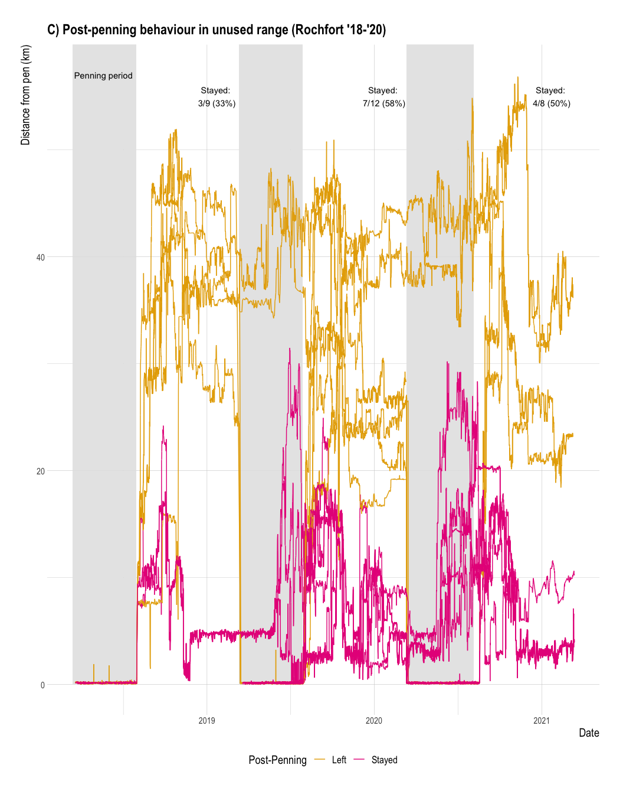
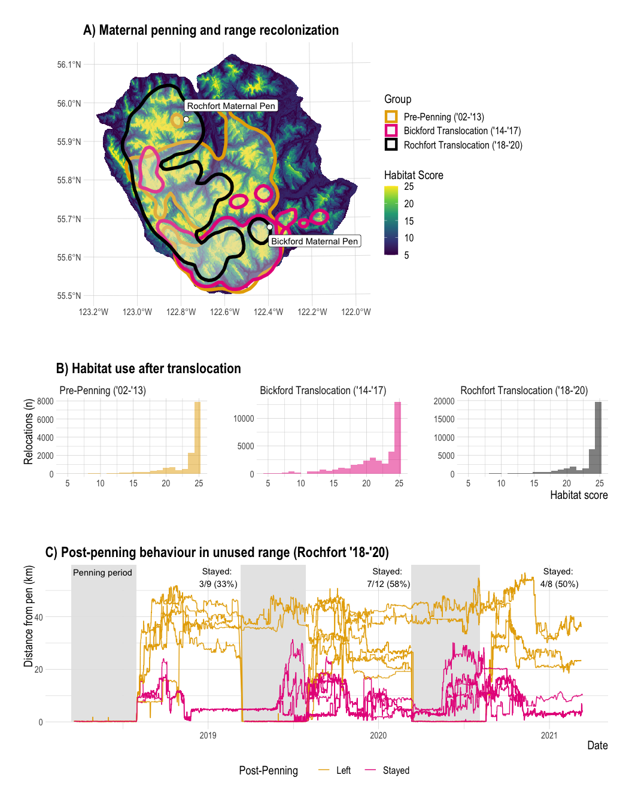

Klinse-Za Range Recolonization
================
Clayton Lamb
23 May, 2021

## Load Packages & Data

``` r
library(sf)
library(here)
library(mapview)
library(lubridate)
library(velox)
library(raster)
library(fasterize)
library(readxl)
library(hrbrthemes)
library(amt)
library(tidyverse)
library(tidygraph)
library(ggraph)
library(ggpubr)
library(tabularaster)
library(tidylog)


#####################
##Load Data
#####################

##telemetry
#st_layers(here::here("data", "telem", "telem_data_request_20210219.gdb"))
 telem <- st_read(here::here("data", "telem", "telem_data_request_20210219.gdb"),layer="KMB_Local_Telemetry_20210219")


mcnay <- read_excel(here::here("data", "telem","KlinseZaAllCollars_210418.xlsx"),
                    sheet="KlinseZaAll_210418")%>%
  drop_na(easting)%>%
  st_as_sf(coords=c("easting", "northing"),
        crs=26910)

pen.yr <- read_csv(here::here("data","whopenned.csv"))

##range
moberly <- st_read(here::here("data", "spatial", "ranges", "GCBP_CARIB_polygon.shp"))%>%
  filter(HERD_NAME%in%"Moberly")%>%
  st_transform(26910)

##Pen locs
pen.locs <- tribble(~name,~lat,~long,
                    "Rochfort Maternal Pen", 55.957422,-122.773424,
                    "Bickford Maternal Pen", 55.676531,-122.391332)%>%
  st_as_sf(coords=c("long","lat"), crs=4326)%>%
  st_transform(26910)%>%
  cbind(st_coordinates(.))%>%
  tibble

##cap
cap <- read_csv(here::here("data", "telem","Capture_210227.csv"))

##towns to clip from telem data (offices collars left on in)
towns <- tribble(~name,~lat,~long,
                 "FSJ", 56.25161403173337, -120.84545438805684,
                 "Mack", 55.3353229828063, -123.0967602935136,
                 "john2", 56.29403813690339, -121.07640843139947)%>%
  st_as_sf(coords=c("long","lat"), crs=4326)%>%
  st_transform(26910)
```

## Explore and clean

``` r
# A helper function that erases all of y from x:
st_erase = function(x, y) st_difference(x, st_union(st_combine(y)))

##keep only KZ (Scott and Moberly) data and trim
#unique(telem$Population_Unit)
telem <- telem%>%filter(Population_Unit%in%c("Scott","Moberly"))%>%
  filter(AlbersX>0)%>%
  st_transform(26910)%>%
  st_erase(towns%>%st_as_sf%>%st_buffer(1000))

hist(telem$Year_)
```

<!-- -->

``` r
telem <- telem %>% filter(Year_<=2013)
#17423 locs in Elena's
#17542 locs in KMB

telem %>% 
    tibble()%>%
    group_by(Animal_ID)%>%
    summarise(n=n())


mcnay <- mcnay%>%
  mutate(Da=str_sub(date_time,0,2),
         Mo=str_sub(date_time,3,5),
         Yr=paste0(20,str_sub(date_time,6,7)),
         Hr=str_sub(date_time,9,10),
         Mn=str_sub(date_time,12,13))%>%
  mutate(datetime=paste0(paste(Yr,Mo,Da,sep="-")," ",paste(Hr,Mn,"00",sep=":"))%>%ymd_hms(),
         Year_=year(datetime))

##remove any locs within the pen and in town
mcnay <- mcnay%>%
  st_erase(pen.locs%>%st_as_sf%>%st_buffer(600))%>%
  filter(!locn_id%in%c(106995, 32280))%>%
  st_erase(towns%>%st_as_sf%>%st_buffer(1000))

#####################
##LOAD MOBERLY RSF FROM ELENA
#####################
rsf_shp <-rbind(
st_read(here::here("data","spatial","Elena_RSF","mob_cal","mob_cal.shp"))%>%filter(!PixelValue==0)%>%mutate(ssn="cal"),
st_read(here::here("data","spatial","Elena_RSF","mob_ew","mob_ew.shp"))%>%filter(!PixelValue==0)%>%mutate(ssn="ew"),
st_read(here::here("data","spatial","Elena_RSF","mob_lw","mob_lw.shp"))%>%filter(!PixelValue==0)%>%mutate(ssn="lw"),
st_read(here::here("data","spatial","Elena_RSF","mob_spr","mob_spr.shp"))%>%filter(!PixelValue==0)%>%mutate(ssn="spr"),
st_read(here::here("data","spatial","Elena_RSF","mob_sum","mob_sum.shp"))%>%filter(!PixelValue==0)%>%mutate(ssn="sum"))%>%
  st_transform(26910)%>%
  mutate(pix=as.numeric(PixelValue))
```

    ## Reading layer `mob_cal' from data source `/Users/clayton.lamb/Google Drive/Documents/University/PDF/PDF Analyses/KZ-penning/data/spatial/Elena_RSF/mob_cal/mob_cal.shp' using driver `ESRI Shapefile'
    ## Simple feature collection with 27616 features and 3 fields
    ## geometry type:  POLYGON
    ## dimension:      XY
    ## bbox:           xmin: 480800 ymin: 6029550 xmax: 669300 ymax: 6229050
    ## projected CRS:  PCI_UTM_Zone_10N
    ## Reading layer `mob_ew' from data source `/Users/clayton.lamb/Google Drive/Documents/University/PDF/PDF Analyses/KZ-penning/data/spatial/Elena_RSF/mob_ew/mob_ew.shp' using driver `ESRI Shapefile'
    ## Simple feature collection with 81263 features and 3 fields
    ## geometry type:  POLYGON
    ## dimension:      XY
    ## bbox:           xmin: 480800 ymin: 6029550 xmax: 669300 ymax: 6229050
    ## projected CRS:  PCI_UTM_Zone_10N
    ## Reading layer `mob_lw' from data source `/Users/clayton.lamb/Google Drive/Documents/University/PDF/PDF Analyses/KZ-penning/data/spatial/Elena_RSF/mob_lw/mob_lw.shp' using driver `ESRI Shapefile'
    ## Simple feature collection with 7576 features and 3 fields
    ## geometry type:  POLYGON
    ## dimension:      XY
    ## bbox:           xmin: 480800 ymin: 6029550 xmax: 669300 ymax: 6229050
    ## projected CRS:  PCI_UTM_Zone_10N
    ## Reading layer `mob_spr' from data source `/Users/clayton.lamb/Google Drive/Documents/University/PDF/PDF Analyses/KZ-penning/data/spatial/Elena_RSF/mob_spr/mob_spr.shp' using driver `ESRI Shapefile'
    ## Simple feature collection with 5895 features and 3 fields
    ## geometry type:  POLYGON
    ## dimension:      XY
    ## bbox:           xmin: 480800 ymin: 6029550 xmax: 669300 ymax: 6229050
    ## projected CRS:  PCI_UTM_Zone_10N
    ## Reading layer `mob_sum' from data source `/Users/clayton.lamb/Google Drive/Documents/University/PDF/PDF Analyses/KZ-penning/data/spatial/Elena_RSF/mob_sum/mob_sum.shp' using driver `ESRI Shapefile'
    ## Simple feature collection with 34137 features and 3 fields
    ## geometry type:  POLYGON
    ## dimension:      XY
    ## bbox:           xmin: 480800 ymin: 6029550 xmax: 669300 ymax: 6229050
    ## projected CRS:  PCI_UTM_Zone_10N

``` r
# Generate empty raster layer and rasterize points
ref <- raster(crs =26910, vals = 0, resolution = c(30,30), ext = extent(c(488200, 571300, 6100350, 6220175)))

##make raster and put together
ssns <- unique(rsf_shp$ssn)
r.list <- list()
for(i in 1:length(ssns)){
 
rsf.i <-fasterize(rsf_shp%>%filter(ssn%in%ssns[i]),
                         ref,
                         field="pix",
                         fun="max",
                         background=NA)

if(i==1){
stack <- stack(rsf.i)
}else(
  stack <- addLayer(stack,rsf.i)
)
}

plot(stack)
```

<!-- -->

``` r
rsf <- calc(stack, sum)

plot(rsf)
```

<!-- -->

``` r
#####################
##PAIR HISTORIC RSF VALUES WITH HISTORIC TELEM DATA
#####################
telem$rsf <- raster::extract(rsf, as(telem, "Spatial"))

# telem <- telem%>%
#   drop_na(rsf)

hist(telem$rsf)
```

<!-- -->

``` r
#####################
##PAIR NEW TELEM DATA WITH TIMING OF PENNING
#####################

##decide who was in the pen and when
pen.yr <- pen.yr%>%
  mutate(pen=case_when(year<2018~"Bickford",year>=2018~"Rochfort"))


ggplot(pen.yr, aes(x=year,y=id, color=loc))+
  geom_point()
```

<!-- -->

``` r
###select rochfort years
roch.animals <- pen.yr%>%
  filter(loc%in%"P" & pen %in% "Rochfort")%>%
  group_by(id)%>%
  summarise(first.year=min(year))


###select bickford years
bick.animals <- pen.yr%>%
  filter(loc%in%"P" & pen %in% "Bickford")%>%
  group_by(id)%>%
  summarise(first.year=min(year))


##join first.year penned to mcnay telem
roch.telem <- mcnay%>%
  rename(id=animal_id)%>%
  left_join(roch.animals)%>%
  filter(!is.na(first.year))%>%
  group_by(id)%>%
  filter(datetime>=ymd(paste(first.year,"08-01",sep="-")))

roch.telem%>%
  group_by(id)%>%
  summarise(n=n(),
            yrs=n_distinct(Yr))  ##Recovers 29 individuals, should be X
```

    ## Simple feature collection with 29 features and 3 fields
    ## geometry type:  MULTIPOINT
    ## dimension:      XY
    ## bbox:           xmin: 466661.7 ymin: 6145990 xmax: 537801.3 ymax: 6214231
    ## projected CRS:  NAD83 / UTM zone 10N

``` r
bick.telem <- mcnay%>%
  rename(id=animal_id)%>%
  left_join(bick.animals)%>%
  filter(!is.na(first.year))%>%
  group_by(id)%>%
  filter(datetime>=ymd(paste(first.year,"08-01",sep="-")) & year(datetime)<2018)

bick.telem%>%
  group_by(id)%>%
  summarise(n=n(),
            yrs=n_distinct(Yr))  ##Recovers 24 individuals, should be X
```

    ## Simple feature collection with 24 features and 3 fields
    ## geometry type:  MULTIPOINT
    ## dimension:      XY
    ## bbox:           xmin: 463557.9 ymin: 6071210 xmax: 659386.3 ymax: 6201254
    ## projected CRS:  NAD83 / UTM zone 10N

``` r
#####################
##PAIR HISTORIC RSF VALUES WITH NEW TELEM DATA
#####################

##extract
roch.telem$rsf <- raster::extract(rsf, as(roch.telem, "Spatial"))
hist(roch.telem$rsf)
```

<!-- -->

``` r
##extract
bick.telem$rsf <- raster::extract(rsf, as(bick.telem, "Spatial"))
hist(bick.telem$rsf)
```

<!-- -->

``` r
#plot
ggplot()+
  geom_sf(data=roch.telem%>%st_as_sf, inherit.aes = FALSE)+
  facet_wrap(vars(id))
```

<!-- -->

``` r
##select only animals that really stayed on Rochfort
roch.telem.stay <-roch.telem%>%
  filter(!id%in%c("CN312K","CN332K","CN347K","CN349S","CN355K","CN369K","CN430K"))%>%
  st_as_sf

roch.telem.stay$rsf <- raster::extract(rsf, as(roch.telem.stay, "Spatial"))

roch.telem.stay <- roch.telem.stay%>%
  drop_na(rsf)

hist(roch.telem.stay$rsf)
```

<!-- -->

``` r
##animals that homed
# mapview(roch.telem%>%st_as_sf%>%filter(id%in%"CN332K"))
# mapview(roch.telem%>%st_as_sf%>%filter(id%in%"CN369K"))


##select only animals that really stayed on Bickford
bick.telem.stay <-bick.telem%>%
  filter(!id%in%c("CN312K","CN332K","CN347K","CN349S","CN355K","CN369K","CN430K"))%>%
  st_as_sf

bick.telem.stay$rsf <- raster::extract(rsf, as(bick.telem.stay, "Spatial"))

bick.telem.stay <- bick.telem.stay%>%
  drop_na(rsf)

hist(bick.telem.stay$rsf)
```

<!-- -->

``` r
#####################
##PAIR HISTORIC RSF VALUES WITH NEW RSF VALUES AND PLOT
#####################

plot.dat <- roch.telem.stay%>%
  mutate(class="Rochfort Translocation ('18-'20)")%>%
  st_as_sf%>%
  select(id,datetime,year=Year_,class,rsf)%>%
  rbind(bick.telem.stay%>%
          mutate(class="Bickford Translocation ('14-'17)")%>%
          st_as_sf%>%
          select(id,datetime,year=Year_,class,rsf))%>%
  rbind(telem%>%
          rename(geometry=Shape)%>%
          st_as_sf%>%
          mutate(class="Pre-Penning ('02-'13)",
                 datetime=ymd_hms(FixDateTime))%>%
          select(id=Animal_ID,datetime,year=Year_,class,rsf)%>%
          st_transform(26910))%>%
  cbind(st_coordinates(.))


#####################
##PAIR HISTORIC RSF VALUES WITH NEW RSF VALUES AND PLOT
#####################

rsf.hist <-plot.dat%>%
  mutate(class=fct_relevel(class,"Pre-Penning ('02-'13)","Bickford Translocation ('14-'17)","Rochfort Translocation ('18-'20)"))%>%
  ggplot(aes(x=rsf,fill=class))+
  geom_histogram(alpha=0.5,bins=22)+
  facet_wrap(vars(class),scales="free_y")+
  theme_ipsum()+
  labs(y="Relocations (n)", x="Habitat score", title="B) Habitat use after translocation")+
  scale_fill_manual(values=c("#e6ab02","#e7298a","black"))+
  theme(axis.title.x = element_text(size=15),
        axis.title.y = element_text(size=15),
        strip.text.x = element_text(size=14),
        axis.text = element_text(size=10),
        legend.text = element_text(size=13),
        legend.title=element_text(size=15),
        legend.position = "none")
rsf.hist
```

<!-- -->

## Calculate Kernel Density Home Ranges

``` r
#####################
##KDE's
#####################
plot.dat2 <- roch.telem%>%
  mutate(class="Rochfort Translocation")%>%
  st_as_sf%>%
  select(id,datetime,year=Year_,class,rsf)%>%
  rbind(bick.telem%>%
          mutate(class="Bickford Translocation")%>%
          st_as_sf%>%
          select(id,datetime,year=Year_,class,rsf))%>%
  rbind(telem%>%
          rename(geometry=Shape)%>%
          st_as_sf%>%
          mutate(class="Pre-Penning",
                 datetime=ymd_hms(FixDateTime))%>%
          select(id=Animal_ID,datetime,year=Year_,class,rsf)%>%
          st_transform(26910))%>%
  st_intersection(moberly)%>%
  cbind(st_coordinates(.))%>%
  tibble

rsf.plot <-rsf%>%
  aggregate(5)%>%
  mask(as(moberly,"Spatial"))%>%
  as.data.frame(xy=TRUE)%>%
  drop_na()


###HOME RANGE ANALYSIS
track <- plot.dat2%>%
  make_track(.x=X, .y=Y, .t=datetime, id = id, class=class,
             crs = CRS("+init=epsg:26910"))
trast <- make_trast(track, res = 1000)
  
kde.ind <- track%>%nest(data =-class) %>% 
  mutate(kde = map(data, ~ hr_isopleths(hr_kde(., trast = trast, level = c(0.95)))))


kde <- rbind(kde.ind$kde[[1]],kde.ind$kde[[2]],kde.ind$kde[[3]])%>%
  mutate(class=c("Pre-Penning ('02-'13)","Bickford Translocation ('14-'17)", "Rochfort Translocation ('18-'20)"))

plot(kde["class"])
```

<!-- -->

``` r
ggplot()+
  geom_sf(data=kde,aes(fill=class),alpha=0.5,inherit.aes = FALSE)
```

<!-- -->

``` r
#mapview(rsf)+mapview(kde["class"])


#####################
##PLOT
#####################

pen.loc.plot<-ggplot()+
  geom_tile(data=rsf.plot,aes(x=x,y=y, fill=layer))+
  geom_sf(data=kde%>%mutate(class=fct_relevel(class,"Pre-Penning ('02-'13)","Bickford Translocation ('14-'17)","Rochfort Translocation ('18-'20)")), 
          aes(colour=class),alpha=0.25, size=2,inherit.aes = FALSE)+
  geom_point(data=pen.locs,aes(x=X,y=Y), size=3, pch=21, fill="white")+
  geom_label(data=pen.locs[1,],aes(x=X,y=Y, label=name),nudge_y = 4000, nudge_x = 13000)+
  geom_label(data=pen.locs[2,],aes(x=X,y=Y, label=name),nudge_y = -4000, nudge_x = 13000)+
  theme_ipsum()+
  scale_colour_manual(values=c("#e6ab02","#e7298a","black"))+
  scale_fill_viridis_c()+
  labs(fill="Habitat Score", color="Group", title="A) Maternal penning and range recolonization")+
  theme(axis.title.x = element_blank(),
        axis.title.y = element_blank(),
        strip.text.x = element_text(size=15),
        strip.text.y = element_text(size=15),
        axis.text = element_text(size=10),
        legend.text = element_text(size=13),
        legend.title=element_text(size=15))
pen.loc.plot
```

<!-- -->

``` r
# ggarrange(pen.loc.plot,rsf.hist,
#   nrow=2, heights=c(2.4,1))
# 
# ggsave(here::here("plots","transloc.png"), width=10,height=9)
```

## Calculate distance from pen after release

``` r
###DISTO
roch.telem.dist <- read_excel(here::here("data", "telem","KlinseZaAllCollars_210418.xlsx"),
                              sheet="KlinseZaAll_210418")%>%
  drop_na(easting)%>%
  st_as_sf(coords=c("easting", "northing"),
           crs=26910)%>%
  st_erase(towns%>%st_buffer(1000))%>%
  mutate(Da=str_sub(date_time,0,2),
         Mo=str_sub(date_time,3,5),
         Yr=paste0(20,str_sub(date_time,6,7)),
         Hr=str_sub(date_time,9,10),
         Mn=str_sub(date_time,12,13))%>%
  mutate(datetime=paste0(paste(Yr,Mo,Da,sep="-")," ",paste(Hr,Mn,"00",sep=":"))%>%ymd_hms(),
         Year_=year(datetime))%>%
  rename(id=animal_id)%>%
  left_join(roch.animals)%>%
  filter(!is.na(first.year))%>%
  group_by(id)%>%
  filter(datetime>=ymd(paste(first.year,"03-20",sep="-")))%>%
  ungroup%>%
  mutate(dist=st_distance(.,pen.locs%>%st_as_sf%>%dplyr::filter(name%in%"Rochfort Maternal Pen"),by_element = TRUE)%>%as.numeric)%>%
  mutate(group=case_when(id%in%c("CN311K","CN313K","CN333K","CN336K","CN338K","CN343S","CN356K","CN364K","CN431K","CN432K")~"Stayed",
                         id%in%c("CN312K","CN317S","CN332K","CN341S","CN347K","CN348S","CN349S","CN355K")~"Left",
                         id%in%c("CN315S") & datetime>ymd("2020-03-14") ~"Stayed",
                         id%in%c("CN315S") & datetime<=ymd("2020-03-14") ~"Left",
                         TRUE~NA_character_))%>%
  arrange(datetime,group,id)


##summarise who stayed/left overall
roch.telem.dist%>%
  filter(Year_%in%2018:2020)%>%
  drop_na(group)%>%
  group_by(group,Year_)%>%
  summarise(n=n_distinct(id))%>%
  pivot_wider(names_from="group",values_from="n")%>%
  mutate(perc=(100*(Stayed/(Left+Stayed)))%>%round(0),
         lab=paste0("Stayed:\n ",Stayed,"/", Left+Stayed, " (",perc,"%)"))


##summarise who stayed/left annually by removing animals that werent penned in each year

keep.id <-roch.telem.dist%>%
  filter(Year_%in%2018:2020)%>%
  group_by(id,Year_,month(datetime))%>%
  summarise(dist=mean(dist))%>%
  filter(`month(datetime)`==5 &dist<1500)%>%
  mutate(id.year=paste(id,Year_,sep="_"))%>%
  pull(id.year)

##how many in pen each year?
#2018=12
#2019=17
#2020=14

roch.telem.dist.summary <-roch.telem.dist%>%
  drop_na(group)%>%
  filter(paste(id,Year_,sep="_")%in%keep.id)%>%
  group_by(group,Year_)%>%
  summarise(n=n_distinct(id))%>%
  pivot_wider(names_from="group",values_from="n")%>%
  mutate(perc=(100*(Stayed/(Left+Stayed)))%>%round(0),
         lab=paste0("Stayed:\n ",Stayed,"/", Left+Stayed, " (",perc,"%)"))


##plot together

disto <- ggplot(roch.telem.dist%>%
                  filter(datetime<ymd("2021-03-13"))%>%
                  drop_na(group), aes(x=datetime,y=dist/1000, group=id, color=group))+
  geom_rect(aes(xmin = ymd_hms("2018-03-13 00:00:00"), xmax =ymd_hms("2018-07-31 00:00:00"), ymin = 0, ymax = Inf),
            alpha = 0.1, fill="grey90", color=NA)+
  geom_rect(aes(xmin = ymd_hms("2019-03-12 00:00:00"), xmax =ymd_hms("2019-07-29 00:00:00"), ymin = 0, ymax = Inf),
            alpha = 0.1, fill="grey90", color=NA)+
  geom_rect(aes(xmin = ymd_hms("2020-03-11 00:00:00"), xmax =ymd_hms("2020-08-05 00:00:00"), ymin = 0, ymax = Inf),
            alpha = 0.1, fill="grey90", color=NA)+
  geom_path()+
  theme_ipsum()+
  scale_colour_manual(values=c("#e6ab02","#e7298a","black"))+
  scale_fill_viridis_c()+
  labs(color="Post-Penning", x="Date", y="Distance from pen (km)", title="C) Post-penning behaviour in unused range (Rochfort '18-'20)")+
  theme(axis.title.x = element_text(size=15),
        axis.title.y = element_text(size=15, vjust=2),
        strip.text.x = element_text(size=14),
        axis.text = element_text(size=10),
        legend.text = element_text(size=13),
        legend.title=element_text(size=15),
        legend.position = "bottom")+
  annotate("text", x = ymd_hms("2018-05-20 00:00:00"), y = 57, label = "Penning period")+
  annotate("text", x = ymd_hms("2019-01-20 00:00:00"), y = 55, label = roch.telem.dist.summary[1,5])+
annotate("text", x = ymd_hms("2020-01-20 00:00:00"), y = 55, label = roch.telem.dist.summary[2,5])+
annotate("text", x = ymd_hms("2021-01-20 00:00:00"), y = 55, label = roch.telem.dist.summary[3,5])


disto
```

<!-- -->

``` r
ggarrange(pen.loc.plot,rsf.hist,disto,
          nrow=3, heights=c(2.4,1.3,2))
```

<!-- -->

``` r
ggsave(here::here("plots","transloc.png"), width=11,height=14)
```
